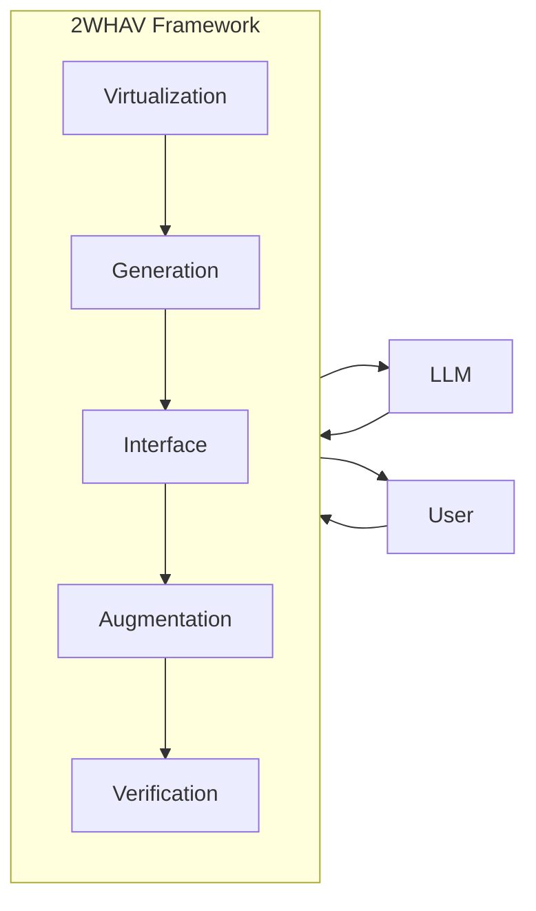

# 2WHAV Framework

2WHAV is a rigorous Prompt Engineering framework designed to maximize the adherence of outputs to specifications. The framework follows the logical flow "What → Where → How → Augment → Verify".

**Framework Schema:**



### Generalization Note ⚠️

*The code examples (Decision Engines, APIs, or *scaffolding*) provided in this guide are **purely illustrative**. The control architecture (**Decision Engine** or **Behavioral Model**) and the **actual APIs** must be defined based on the **specific domain** (e.g., Logistics, Trading, Gaming) required in the prompt. For consistency, the concrete examples use **JavaScript**.*

### 🚀 Quick Example: The Problem 2WHAV Solves

**Objective:** Create a function that validates an email via an external API, with automatic retry on failure.

#### ❌ Traditional Prompt (Ambiguous)

```
Write a JavaScript function that validates an email by calling an API.
It should retry if it fails.
```

**What's missing?**

- How many times to retry? (2? 3? 10?)
- With what strategy? (Exponential backoff? Fixed delay?)
- What to return if it fails completely?
- What syntax? (async/await? Promises? callbacks?)

**Result:** The LLM has to guess, producing code that likely doesn't meet your expectations.

#### ✅ With 2WHAV (Clear Contract)

```
# Email Validator with Retry

## WHAT: Objective
Create an async function `validateEmail(email)` that validates an email
address via an external API. On error, it must retry up to 3 times
with exponential backoff (100ms, 200ms, 400ms).

Output: Object `{ valid: boolean, attempts: number, error?: string }`

## HOW: Rules
- MANDATORY: Use `async function validateEmail(email) { ... }` syntax
- MANDATORY: Use try/catch for each attempt
- FORBIDDEN: Using setTimeout (use only synchronous delay for simplicity)

## HOW: API
You can ONLY call:
- `api.checkEmail(email)` → Promise<boolean> (can reject with Error)

## AUGMENT: Extra Intelligence
Beyond the basic retry, implement:
1. Log each failed attempt with `console.warn()`
2. If all attempts fail, include the error message in the output

## VERIFY: Checklist
- [ ] Is the function async?
- [ ] Exactly 3 attempts?
- [ ] Exponential backoff (100ms, 200ms, 400ms)?
- [ ] Returns `{ valid, attempts, error? }`?
- [ ] Is failure logging implemented?
```

**Result:** Zero ambiguity. The LLM generates precise, compliant code without needing corrective iterations.

## 1. WHAT: Introduction and Objective (WHAT)

This phase constitutes the **statement of intent** and establishes the purpose. It defines **what you want**, the **exact final result** to be produced, and the **main purpose of the prompt**.

The **WHAT** specifies what the LLM will have to do, using all subsequent phases as a technical manual (HOW, Augmentation, and Verification). For this reason, this section must be **as specific as possible**, including:

- **Role and Expertise:** Assigning the exact role to the LLM (e.g., "You are a Senior JavaScript Engineer").
- **Flow Constraints:** If there are operational constraints or a main flow (e.g., "The system must prioritize data reading before any writing").
- **Initial Rules and Constraints:** Any general operational rules or constraints necessary to achieve the final result.
- **Output Format:** Specification of the required format (e.g., "ONLY JavaScript code in a single literal object").

Note: Be clear and detailed when specifying the purpose. The more specific your goal, the better the results will be.

- **Components of WHAT:**

  - **What First** - Purpose: Defines the final goal and the LLM's role (Logic: WHAT)

  - **Index** - Purpose: Provides a navigation map and validates the prompt's structure (Logic: WHAT)

Note: An index is important in long prompts because it helps the LLM orient itself and establish a clear **mental map** of the document.

### Practical Example (Start of the Prompt - JS)

```
# 🚀 2WHAV Prompt: Logistics Decision Agent v1.0 (JavaScript) 🚀

## 1. WHAT: Introduction and Index

### What First: Purpose and Expected Outcome
You are an expert in decision-making systems. Your task is to create the **Decision Engine** for an agent that optimizes warehouse logistics.
The output **MUST** be **ONLY** **JavaScript** code formatted as a **Single Literal Object** (e.g., `const agentLogic = { ... }`).

### # Index
| Section | Logic | Purpose |
| :--- | :--- | :--- |
| **# 1. Virtualization** | WHERE | Behavioral Model and Flow Priority. |
| **# 2. Generation** | HOW | Syntax rules and scaffolding. |
| **# 3. Interface** | HOW | API documentation. |
| **# 4. Augmentation** | AUGMENTATION | Strategic and creative directives. |
| **# 5. Verification** | VERIFY | Final compliance checklist. |
```

## Virtualization, Generation, Interface, Augmentation (HOW)

This phase defines all the operational rules for executing the task.

### 2. (WHERE): Virtualization (Behavioral Model)

Defines the **logical model that the code must implement**. This is the phase where the LLM is instructed not only on the _type_ of code but on its **internal control architecture**. Instead of providing the LLM with the entire code of the target environment, **virtualization describes its execution context and abstract rules**. For example, it is clearly specified that the code must be a **Finite State Machine (FSM)**, a **Behavior Tree**, or a ruleset, defining the **structure** that the LLM will have to populate. This allows the LLM to deeply understand **how the generated code will be used**, optimizing the rest of the information provided in the prompt. Here, the **hierarchical order** and **absolute priority** of its decisions are established. **Indicate here the complete description of the operational model: not just the architecture (e.g., FSM), but also the execution cycle, data flow, and decision priorities.**

**Component of Virtualization:**

**Flow Specification**

- Purpose: Establishes the control architecture (e.g., FSM, Behavior Tree, etc.) and the priority of decisions.
- Critical Requirement: The model is a Decision Engine with an evaluation priority (e.g., Urgency -> Planning).

#### Practical Example (Illustrative FSM Decision Engine - JS)

```
## 2. WHERE: Virtualization (Behavioral Model)

### Decision Engine Specification
- The Decision Engine (illustrated here as an FSM for clarity) must evaluate its logic in **this inviolable order of priority**:
    1.  **URGENCY (Max Priority):** Safety or critical logic (e.g., 'Avoid Collision').
    2.  **PLANNING (High Priority):** Sequences of actions to complete a task (e.g., 'Move Towards Area').
    3.  **STANDARD (Normal Priority):** Waiting or monitoring logic.
- buildContext() is called before each decision cycle
- buildContext() populates context.x, context.y, context.z
- States receive context.delta and context.gamma as input
- Transitions evaluate higher-level conditions first
```

### 3. (HOW): Generation (Rules and COMPLETE Scaffolding)

This phase establishes the **unbreakable rules for writing the code**. Its goal is twofold: to impose standards for **clean and robust code** and to define the **mandatory structures** and **technical limitations** necessary for integration. Here, the LLM receives the **exact scaffolding** it must populate and the syntactic rules it must respect, such as the obligation to use a specific naming convention or the prohibition of using modern, unsupported functions.

**⚠️ Critical Note:**

**This phase contains the most critical rules for code generation. In the prompt, these rules must be communicated with strong prescriptive language (MANDATORY, FORBIDDEN) to maximize the LLM's adherence. Non-compliance with these rules significantly compromises the integration of the generated code.**

**Components of Generation:**

- **General Rules**

  - Purpose: Imposes style standards and technical compatibility.
  - Critical Requirement: E.g., MANDATORY: Only function(...) {} (no =>). Helper access ONLY via agentLogic.helper().

- **Scaffolding**
  - Purpose: Provides the exact skeleton and mandatory formats for the Decision Engine's structures.
  - Critical Requirement: E.g., Must be compatible with the chosen architecture (Object, FSM, BT, etc.).

#### Practical Example (JavaScript Scaffolding)

⚠️ **NOTE:** The following rules (e.g., prohibition of arrow functions) are specific to this embedded system example. In YOUR prompt, define ONLY the rules necessary for YOUR environment/standards.

```
## 3. HOW: Generation (Rules and COMPLETE Scaffolding)

### General Code Generation Rules
* **Function Syntax:** It is **MANDATORY** to use `function(...) { ... }`. **ARROW FUNCTIONS (`=>`) ARE FORBIDDEN**.

### Code Scaffolding (Mandatory Template)
const agentLogic = {
  initialState: 'IDLE',
  memory: { /* Persistent data */ },
  CONSTANTS: { MAX_LOAD: 500 },

  updateContext: function(api, externalData) {
    // Must return the 'context' object
    return {};
  },

  decideAction: function(api, externalData) {
    // Decision logic following priority 2.1
    const context = agentLogic.updateContext(api, externalData);
    // [Decision Engine execution logic]
  },

  // Implementation of a Helper (Mandatory for verification)
  _checkAreaOccupancy: function(areaId) {
    // Returns a boolean
    return false;
  }
};
```

### 4. (HOW): Interface (Interaction Protocol)

This phase defines the **only means by which the code can interact with the external system**. The purpose is not just to list functions, but to document them with absolute precision: **input and output types, handled exceptions, and specific behaviors**. The LLM must treat this **Interaction Protocol** as an inviolable API contract and must not invoke any functions or methods not explicitly defined in this section.

**Component of the Interface:**

- **API Table**

  - Purpose: Documents every interaction function.
  - Output: The generated code MUST NOT use undocumented API calls.
  - Critical Requirement: [specified in the documented APIs]

#### Practical Example

```
## 4. HOW: Interface (API Interaction)
The code interacts ONLY through the `api` object:

| Function | Input | Output | Critical Note |
|----------|-------|--------|--------------|
| `api.getLocation()` | void | `object` {x, y} | Current agent position. |
| `api.requestPath(target)` | `object` {x, y} | `boolean` | Requests a path; **FAILABLE**. |
| `api.loadItem(item_id)` | `string` | `boolean` | Attempts to load an item. |
```

### 5. (Augment): Augmentation (Strategic Directives)

This phase requires the LLM to implement **advanced logic beyond the minimum requirement** specified in the WHAT. The goal is to obtain code that is not just functional, but **optimized, resilient, and strategically robust**.

The Augmentation explicitly specifies:

- Optimization mechanisms (e.g., opportunity cost, caching)
- Resilience logic (e.g., retry, fallback, validation)
- Preventive features (e.g., risk assessment, anomaly detection)

This logic must be **explicitly requested** in this section, even if it was not mentioned in the initial `WHAT` phase.

**Component of Augmentation:**

• **Creativity Directive**

- Purpose: Injects intelligence and tactical complexity.
- Strategic Directive: Requires the implementation of advanced logic not explicit in the scaffolding.

#### Practical Example

```
## 5. HOW: Augmentation (Strategic Directives)

**CREATIVITY DIRECTIVE:**
The LLM MUST implement logic that goes beyond solving the basic task ("go to X and load Y"):

1.  **STRATEGIC OPTIMIZATION:** Do not just calculate the shortest path, but implement a system that evaluates the **opportunity cost** for each available task (travel time + item priority) before making a decision.
2.  **RESILIENCE:** The Decision Engine must include **error prevention** mechanisms, such as a **memory caching** system for critical locations or an advanced *timeout* and *retry* mechanism not explicitly required in the WHAT.
3.  **CRITICAL THINKING:** Add a helper method (`agentLogic._calculateRisk`) that assesses collision risk based on historical data.
```

### 6. VERIFY: Verification

The final phase requires the LLM to self-verify compliance with all contractual requirements.

#### (You Did Well): Verification (Final Quality Check)

This phase serves as a **final reminder** of the most critical requirements. The checklist is included at the end of the prompt to:

- Reinforce key rules before output generation
- Provide a quick reference for manual validation
- Increase the likelihood that the LLM will consider these constraints during generation
  **Note:** LLMs do not perform autonomous post-generation verification. The checklist influences the generation process, but final validation remains the user's responsibility.

**Component of Verification:**

**Checklist**

- Purpose: A summary of the most critical requirements from Virtualization and Generation.
- Verification Requirement: A reminder for the LLM + a manual validation tool for the user.

#### Practical Example

This is the **final phase** and serves as a **final reminder** of the most critical requirements. The checklist reinforces key rules during output generation and provides a validation tool for the user. Include this section at the end of the prompt to maximize the probability that the LLM will consider these constraints during code generation.

```
## 6. VERIFY: Verification (Compliance Checklist)

Before providing the output, verify that the code respects:
* [ ] Is the output a single JavaScript literal object?
* [ ] Are ONLY `function(...) {}` used (no `=>`)?
* [ ] Does the logic adhere to the **Urgency** → **Planning** → **Standard** priority?
* [ ] Is the **memory caching** and **opportunity cost** logic implemented?
```

## 🧩 Modularity and Flexibility of the 2WHAV Framework

Although the **2WHAV** framework was designed to handle maximum complexity, its architecture is **inherently modular**. Not all phases are mandatory in every scenario, allowing the level of rigor to be adapted to the specific task.

### Phase Flexibility:

- **Virtualization** (Where)

  - Flexibility: Can be condensed/omitted
  - Condition for Omission: If using an architecture or library highly known to the LLM (e.g., XState or Redux), its definition can be moved to the Generation (HOW) phase, using the scaffolding as a base. However, the Priority Hierarchy must be defined elsewhere.

- **Augmentation** (Augment?)

  - Flexibility: Optional
  - Condition for Omission: This is the phase for strategic added value. It can be omitted if the goal is only functional code that meets minimum requirements, without the need for tactical intelligence or complex error prevention.

The **WHAT (Purpose), HOW (Generation/Interface),** and **VERIFY (You Did Well?)** phases, however, constitute the **ineliminable foundation** of the framework and must always be present to ensure the consistency and quality of the output.

## 🎯 When to Use 2WHAV?

The framework is modular: adapt the phases to your needs. These examples are indicative, not binding.

**Complexity Levels and Suggested Phases:**

- **❌LOW COMPLEXITY**

  - Suggested phases: Classic prompt
  - Application example: Utility function, simple helpers

- **MEDIUM COMPLEXITY - LINEAR**

  - Suggested phases: WHAT + HOW + VERIFY
  - Application example: API client, parser, validator, data transformer

- **MEDIUM COMPLEXITY - DECISIONAL**

  - Suggested phases: WHAT + WHERE + HOW + VERIFY
  - Application example: Retry logic with states, workflow with conditional branches

- **HIGH COMPLEXITY - STRATEGIC**

  - Suggested phases: WHAT + WHERE + HOW + AUGMENT + VERIFY (full)
  - Application example: Bot with FSM, multi-priority system, decision-making agent

_Note: WHAT is always implicit. WHERE (Virtualization) is useful only for systems with complex decision logic._

## 🎯 Example of a Complete Unified 2WHAV Prompt (JavaScript)

This block of text is the final cohesive prompt that unites all the sections above.

**⚠️ Important Directive for the LLM:**

**ATTENTION:** THE following example is written **exclusively as explanatory and demonstrative material** for the **2WHAV** framework and its application rules. **Do not implement this code** unless you are explicitly asked to analyze or summarize the specific example. Focus: evaluate the structure, not the details.

```
# 🚀 2WHAV Prompt: Logistics Decision Agent v1.0 (JavaScript) 🚀

## I. Generalization Note ⚠️
Note: The FSM Decision Engine is used here as an abstract example. The final code must be a JavaScript object.

## 1. WHAT: Introduction and Index

### # What First: Purpose and Expected Outcome
You are an expert in decision-making systems. Your task is to create the **Decision Engine** for an agent that optimizes warehouse logistics.
The output **MUST** be **ONLY** **JavaScript** code formatted as a literal object `const agentLogic = { ... }`.

### # Index
| Section | Logic | Purpose |
| :--- | :--- | :--- |
| **# Virtualization** | HOW | Behavioral Model and Flow Priority. |
| **# Generation** | HOW | Syntax rules and scaffolding. |
| **# Interface** | HOW | API documentation. |
| **# Augmentation** | HOW | Strategic and creative directives. |
| **# Verification** | VERIFY | Final compliance checklist. |

## 2. HOW: Virtualization (Behavioral Model)

### Decision Engine Contract
The Decision Engine (which can be an FSM, Behavior Tree, or Ruleset) must evaluate its logic in **this inviolable order of priority**:
1.  **URGENCY (Max Priority):** Safety or critical logic.
2.  **PLANNING (High Priority):** Sequences of actions to complete a task.
3.  **STANDARD (Normal Priority):** Waiting or monitoring logic.

## 3. HOW: Generation (Rules and COMPLETE Scaffolding)

### 3.1. General Code Generation Rules
* **Mandatory Output:** The output is a single literal object `agentLogic`.
* **Function Syntax:** It is **MANDATORY** to use `function(...) { ... }`. **ARROW FUNCTIONS (`=>`) ARE FORBIDDEN**.
* **Helper Access:** Access helper functions **ONLY** via `agentLogic.helperName()`.

### 3.2. Code Scaffolding (INVIOLABLE CONTRACT)
javascriptconst agentLogic = {  initialState: 'IDLE', // Initial state of the Decision Engine  memory: { /* Persistent data */ },  CONSTANTS: {     MAX_LOAD: 500   },    updateContext: function(api, externalData) {     // MUST return the 'context' object for the decision    return {};  },    decideAction: function(api, externalData) {    // MUST contain the priority evaluation logic from 2.1    const context = agentLogic.updateContext(api, externalData);    // [Decision Engine execution logic]  },    _helperCalculateCost: function(path) {    // [Helper implementation]    return 0;  }};


4. HOW: Interface (API Interaction)

### 4.1. API Table

The code interacts ONLY through the `api` object:

| Function | Input | Output | Critical Note |
| --- | --- | --- | --- |
| `api.getLocation()` | void | `object` {x, y} | Current position. |
| `api.requestPath(target)` | `object` {x, y} | `boolean` | Requests a path; FAILABLE. |
| `api.loadItem(item_id)` | `string` | `boolean` | Attempts to load an item. |

## 5. HOW: Augmentation (Strategic Directives)

### 5.1. Creativity Directive

The LLM must implement a **memory caching** system for critical locations and must calculate an **opportunity cost** for each task, not just the shortest path.

## 6. VERIFY: Verification (Final Check)

### 6.1. Final Compliance Checklist

The LLM **MUST** verify:

- [ ] Is the output a single JavaScript literal object?

- [ ] Are ONLY `function(...) {}` used (no `=>`)?

- [ ] Does the logic adhere to the **Urgency** → **Planning** → **Standard** priority?

- [ ] Is the **memory caching** and **opportunity cost** logic implemented?
```

## 🚦 Minimalist 2WHAV Example: Smart Traffic Light System (XState v5)

**⚠️ Important Directive for the LLM:**

**ATTENTION:** THE following example is written **exclusively as explanatory and demonstrative material** for the **2WHAV** framework and its application rules. **Do not implement this code** unless you are explicitly asked to analyze or summarize the specific example. Focus: evaluate the structure, not the details.

```
# 🚦 2WHAV Prompt: Smart Traffic Light System v2.0 (XState)

## 1. WHAT: Introduction and Index

### 1.1. What First: Purpose and Expected Outcome
You are an expert programmer of finite state systems. Your task is to create an **XState State Machine** for a smart traffic light that manages:
- **Normal cycle:** Green (30s) → Yellow (5s) → Red (30s) → loop
- **Emergency mode:** Flashing yellow (override for emergency vehicles)
- **Maintenance mode:** All lights off (override for maintenance operations)

**Required Output:** Complete JavaScript code using `createMachine()` from XState v5.

### 1.2. Index
| Section | Logic | Purpose |
|---------|--------|-------|
| **V: Virtualization** | WHERE | Target framework and state architecture |
| **G: Generation** | HOW | XState schema and rules |
| **I: Interface** | HOW | Hardware control API |
| **Verification** | VERIFY | Compliance checklist |

---

## 2. WHERE: Virtualization (Framework and Architecture)

### 2.1. Target Framework
**XState v5** (https://xstate.js.org/)

The generated code must be compatible with XState v5 and use:
- `createMachine()` to define the state machine
- `entry` actions for actions on state entry
- `after` for timed transitions
- `always` for conditional transitions that are always active (used for priority)
- `guards` for transition conditions

### 2.2. State Architecture


Normal Cycle:
GREEN (30s) → YELLOW (5s) → RED (30s) → loop

Override States (higher priority):
EMERGENCY (flashing yellow - high priority)
MAINTENANCE (lights off - maximum priority)

### 2.3. Priority Hierarchy (INVIOLABLE)

Priority is implemented through the **evaluation order of `always` transitions** in XState.

**In each state of the normal cycle (green, yellow, red), the `always` transitions must be in this order:**

| Order | Priority | Target | Guard | Description |
|--------|----------|--------|-------|-------------|
| 1 | **MAXIMUM** | `maintenance` | `isMaintenanceMode` | Absolute override for maintenance |
| 2 | **HIGH** | `emergency` | `isEmergency` | Override for emergency vehicles |
| 3 | **NORMAL** | (next state) | `after` timeout | Normal timed transition |

**FUNDAMENTAL RULE:** `always` transitions have priority over `after` transitions. The order in the `always` array determines the evaluation priority.

---

## 3. HOW: Generation (XState Schema and Rules)

### 3.1. Generation Rules

> **⚠️ NOTE:** The following rules are derived from XState v5 conventions.

* **Output Structure:** Use `createMachine()` from XState
* **States:** Defined in the `states` object, names in lowercase (e.g., `green`, `emergency`)
* **Actions:** Defined in the `actions` object (second parameter of `createMachine`)
* **Guards:** Defined in the `guards` object (second parameter of `createMachine`)
* **Entry Actions:** Each cycle state must have `entry: 'actionName'` to call the hardware API
* **Time-based Transitions:** Use `after: { milliseconds: 'targetState' }`
* **Conditional Transitions:** Use `always: [{ target: '...', guard: '...' }]`

### 3.2. XState Scaffolding

import { createMachine, interpret } from 'xstate';

const trafficLightMachine = createMachine({
  id: 'trafficLight',
  initial: 'green',

  context: {
    // Context (optional, can be used for internal state)
  },

  states: {
    green: {
      entry: 'activateGreenLight',

      // Priority transitions (ALWAYS IN THIS ORDER)
      always: [
        { target: 'maintenance', guard: 'isMaintenanceMode' },
        { target: 'emergency', guard: 'isEmergency' }
      ],

      // Normal timed transition
      after: {
        30000: 'yellow'  // 30 seconds
      }
    },

    yellow: {
      entry: 'activateYellowLight',

      always: [
        { target: 'maintenance', guard: 'isMaintenanceMode' },
        { target: 'emergency', guard: 'isEmergency' }
      ],

      after: {
        5000: 'red'  // 5 seconds
      }
    },

    red: {
      entry: 'activateRedLight',

      always: [
        { target: 'maintenance', guard: 'isMaintenanceMode' },
        { target: 'emergency', guard: 'isEmergency' }
      ],

      after: {
        30000: 'green'  // 30 seconds
      }
    },

    emergency: {
      entry: 'activateEmergencyBlink',

      always: [
        { target: 'maintenance', guard: 'isMaintenanceMode' },
        // Return to green when emergency ends
        { target: 'green', guard: ({ context }) => !context.isEmergency }
      ]
    },

    maintenance: {
      entry: 'deactivateAllLights',

      always: [
        // Return to green when maintenance ends
        { target: 'green', guard: ({ context }) => !context.maintenanceMode }
      ]
    }
  }
}, {
  // ===== ACTIONS =====
  actions: {
    activateGreenLight: () => {
      api.setLight('GREEN');
    },

    activateYellowLight: () => {
      api.setLight('YELLOW');
    },

    activateRedLight: () => {
      api.setLight('RED');
    },

    activateEmergencyBlink: () => {
      api.blinkYellow();
    },

    deactivateAllLights: () => {
      api.setLight('OFF');
    }
  },

  // ===== GUARDS =====
  guards: {
    isMaintenanceMode: () => {
      return api.isMaintenanceModeActive();
    },

    isEmergency: () => {
      return api.isEmergencyVehicleDetected();
    }
  }
});

// Creating the interpreter (optional, to run the machine)
const service = interpret(trafficLightMachine).start();


---

## 4. HOW: Interface (Hardware Control API)

### 4.1. API Table

The code interacts **EXCLUSIVELY** through the global `api` object. Any other interaction is **FORBIDDEN**.

| Function | Input | Output | Description | Critical Note |
| --- | --- | --- | --- | --- |
| `api.setLight(color)` | `string`: `'GREEN'`, `'YELLOW'`, `'RED'`, `'OFF'` | `void` | Sets the physical traffic light color | **Mandatory** call in every entry action |
| `api.blinkYellow()` | `void` | `void` | Activates yellow flashing mode (managed by hardware controller) | Only for `emergency` state |
| `api.isEmergencyVehicleDetected()` | `void` | `boolean` | Checks if sensor detects an emergency vehicle | Can change in real-time |
| `api.isMaintenanceModeActive()` | `void` | `boolean` | Checks if maintenance is active | Manually set by an operator |

### 4.2. API Notes

- **Synchronicity:** All API calls are synchronous
- **Availability:** The `api` object is global and always available
- **Error Handling:** APIs do not throw exceptions (they are fail-safe)

---

## 5. VERIFY: Verification (Compliance Checklist)

### 5.1. Mandatory Checklist

The LLM **MUST** self-check these requirements before providing the output:

#### XState Structure

- [ ] Does the code use `createMachine()` from XState v5?
- [ ] Does the machine have `id: 'trafficLight'` and `initial: 'green'`?
- [ ] Are there exactly 5 states: `green`, `yellow`, `red`, `emergency`, `maintenance`?

#### Entry Actions

- [ ] Does each state have an `entry` action defined?
- [ ] Are the entry actions defined in the `actions` object (second parameter of `createMachine`)?
- [ ] Does each entry action call the appropriate API function (`api.setLight()` or `api.blinkYellow()`)?

#### Priority Hierarchy (CRITICAL)

- [ ] Does the `green` state have an `always` array with 2 transitions in the order: `maintenance`, `emergency`?
- [ ] Does the `yellow` state have an `always` array with 2 transitions in the order: `maintenance`, `emergency`?
- [ ] Does the `red` state have an `always` array with 2 transitions in the order: `maintenance`, `emergency`?
- [ ] Is priority implemented via **evaluation order** in the `always` array?

#### Guards

- [ ] Are the guards defined in the `guards` object (second parameter of `createMachine`)?
- [ ] Is there an `isMaintenanceMode` guard that calls `api.isMaintenanceModeActive()`?
- [ ] Is there an `isEmergency` guard that calls `api.isEmergencyVehicleDetected()`?

#### Timed Transitions

- [ ] Does the `green` state have `after: { 30000: 'yellow' }`?
- [ ] Does the `yellow` state have `after: { 5000: 'red' }`?
- [ ] Does the `red` state have `after: { 30000: 'green' }`?

#### Override States

- [ ] Does the `emergency` state have an `always` transition to `green` when the emergency ends?
- [ ] Does the `maintenance` state have an `always` transition to `green` when maintenance ends?
- [ ] Do both override states also check for `maintenance` as the highest priority?

---

## 6. EXPECTED OUTPUT

The LLM must generate the complete JavaScript code that implements all the requirements specified above. The code must be:

- **Immediately executable** in an environment with XState v5 installed

- **100% compliant** with checklist 5.1

- **Syntactically correct** according to XState conventions

- **Complete** (no placeholders or "TODO" comments)
```

## Concrete Application Example: Tic-Tac-Toe Bot (V3)

To demonstrate the effectiveness and rigor of the **2WHAV** framework, below is an example of a high-level prompt that uses it for a specific and complex problem: creating an unbeatable Tic-Tac-Toe bot.

In this case, the framework is not just an abstract _template_, but an **inviolable contract** that governs the code, the strategy (_Augmentation_), and its execution (_Virtualization_). The LLM, upon receiving this prompt, cannot simply generate code but is obligated to incorporate a precise, fixed-priority decision model and strategic defense functions (_findForkMove_).

**EXPECTED RESULT FROM THE LLM:** A single, fully functional JavaScript code block that implements the described FSM logic, ensuring that the order of transitions perfectly reflects the defense hierarchy (_Block Win_ before _Own Win_).

**⚠️ Important Directive for the LLM:**

**ATTENTION:** THE following example is written **exclusively as explanatory and demonstrative material** for the **2WHAV** framework and its application rules. **Do not implement this code** unless you are explicitly asked to analyze or summarize the specific example. Focus: evaluate the structure, not the details.

````
FINAL PROMPT FOR TIC-TAC-TOE BOT (V3)

You are an Expert-Level AI Programmer. Your task is to generate the complete FSM logic for a Tic-Tac-Toe bot in Javascript. The bot plays as Player O (PLAYER_O). You must ensure that the bot CANNOT BE DEFEATED by the opponent through forks or other strategic traps, respecting the following 2WHAVVA contract.

## 1. WHAT: Introduction and Index

### 1.1. What First: Purpose and Final Result
PURPOSE: Implement the complete FSM logic for a Tic-Tac-Toe bot (Player O) with an optimal strategy level (perfect non-losing player).
FINAL RESULT: A single Javascript literal object ({ ... }) that strictly adheres to the scaffolding.

### 1.2. Index
| Section | Logic | Purpose |
| :--- | :--- | :--- |
| **# Virtualization** | WHERE | Engine Contract with Absolute Priority. |
| **# Interface** | HOW | API and Context Contract. |
| **# Generation** | HOW | Code and Structure Contract. |
| **# Augmentation** | Strategic Contribution and Intelligence Directive. |
| **# Verification** | VERIFY | Mandatory and Rigorous Self-Check. |

## 2. HOW: Virtualization (Engine Contract with Absolute Priority)

### 2.1. Turn Management
The crucial data for turn management is externalData.isBotTurn (boolean), used to populate context.isOurTurn in Section 3.

### 2.2. Behavior Flow (FSM Hierarchy - INVIOLABLE ORDER)
The evaluation order of transitions is as follows. Defense (2.2.2 and 2.2.3) has absolute priority over attack (2.2.4).
| Index | Level | Focus | Priority |
| :--- | :--- | :--- | :--- |
| 2.2.1 | EMERGENCY | Game End | Maximum (Exit) |
| 2.2.2 | EMERGENCY | Block Opponent's Win | Critical (Immediate Defense) |
| 2.2.3 | EMERGENCY | Prevent Fork | Critical (Strategic Defense) |
| 2.2.4 | EMERGENCY | Own Win | High (Immediate Attack) |
| 2.2.5 | TACTICAL | Create Fork | Medium (Strategic Attack) |
| 2.2.6 | TACTICAL | Fallback Move | Standard |

## 3. HOW: I: Interface (API and Context Contract)

### 3.1. API Functions
The code interacts exclusively through `api` and the constructed `context` object.
| Function | Description |
| :--- | :--- |
| `api.getBoard()` | Array of 9 elements ('X', 'O', null). |
| `api.getGameStatus()` | Status: 'O', 'X', 'TIE' or null. |
| `api.getAvailableMoves()`| Indices of empty cells (legal moves). |
| `api.makeMove(index)` | Executes the move. MANDATORY in `onEnter`. |

## 4. HOW: Generation (Code and Structure Contract)

### 4.1. Syntax Rules
* Output = single literal object ({ ... }).
* All functions use `function(...) { ... }` syntax (**no Arrow Functions `=>`**).
* Helpers are called with `fsmDefinition.helperName()`.

### 4.2. Scaffolding (Total Integrity)
```javascript
// SAVE a reference to the object to access helpers
const fsmDefinition = {
  // ===== SECTION A: CONFIGURATION (initialState, initialMemory, constants) =====
  initialState: 'IDLE',

  initialMemory: {
    moveCount: 0
  },

  constants: {
    PLAYER: 'O', OPPONENT: 'X', TIE: 'TIE',
    WINNING_LINES: [
      [0, 1, 2], [3, 4, 5], [6, 7, 8],
      [0, 3, 6], [1, 4, 7], [2, 5, 8],
      [0, 4, 8], [2, 4, 6]
    ],
  },

  // ===== SECTION B: CONTEXT CONSTRUCTION (buildContext) =====
  buildContext: function(api, memory, events, externalData) {
    // Implement context construction, including deriving context.isOurTurn
    return {
      board: api.getBoard(),
      availableMoves: api.getAvailableMoves(),
      gameStatus: api.getGameStatus(),
      isOurTurn: externalData.isBotTurn,
    };
  },

  // ===== SECTION C: HELPER FUNCTIONS (Strategic Logic) =====

  // *** MANDATORY: Robust and commented implementation ***
  findWinningMove: function(board, player, availableMoves, constants) {
    // Returns the index of the winning move (0-8) or null
  },

  // *** MANDATORY: Critical Function for Bot Survival ***
  findForkMove: function(board, player, availableMoves, constants) {
    // Returns the index that creates or blocks a fork (double threat), otherwise null.
    // YOU MUST comment the logic used for fork detection.
  },

  // ===== SECTION D: EMERGENCY TRANSITIONS (Level 1) - ENFORCED ORDER (2.2) =====
  emergencyTransitions: [
    // 1. Game End (2.2.1)
    { target: 'GAME_OVER', condition: function(api, memory, context, events) { return context.gameStatus !== null; } },

    // 2. Block Opponent's Win (2.2.2)
    {
      target: 'BLOCKING_MOVE',
      condition: function(api, memory, context, events) {
        return context.isOurTurn && fsmDefinition.findWinningMove(context.board, context.constants.OPPONENT, context.availableMoves, context.constants) !== null;
      },
      description: 'MANDATORY BLOCK: Prevents immediate win for X.'
    },

    // 3. Prevent Opponent's Fork (2.2.3)
    {
      target: 'BLOCKING_MOVE',
      condition: function(api, memory, context, events) {
        return context.isOurTurn && fsmDefinition.findForkMove(context.board, context.constants.OPPONENT, context.availableMoves, context.constants) !== null;
      },
      description: 'Prevents the creation of a fork (double threat) by X.'
    },

    // 4. Own Win (2.2.4)
    {
      target: 'WINNING_MOVE',
      condition: function(api, memory, context, events) {
        return context.isOurTurn && fsmDefinition.findWinningMove(context.board, context.constants.PLAYER, context.availableMoves, context.constants) !== null;
      },
      description: 'Finds the immediate winning move.'
    }
  ],

  // ===== SECTION E: TACTICAL TRANSITIONS (Level 2) =====
  tacticalTransitions: [
    // 1. Create Own Fork (2.2.5)
    {
      target: 'STRATEGIC_MOVE',
      condition: function(api, memory, context, events) {
        return context.isOurTurn && fsmDefinition.findForkMove(context.board, context.constants.PLAYER, context.availableMoves, context.constants) !== null;
      },
      description: 'Creates a fork (double threat).'
    },
    // 2. Fallback Move (2.2.6)
    {
      target: 'STRATEGIC_MOVE',
      condition: function(api, memory, context, events) {
        return context.isOurTurn;
      },
      description: 'Executes the strategic move (Center/Corners/Sides).'
    }
  ],

  // ===== SECTION F: MACHINE STATES (onEnter/onExit/transitions) =====
  states: {
    IDLE: { /* ... */ },
    WINNING_MOVE: { /* ... */ },

    BLOCKING_MOVE: {
      onEnter: function(api, memory, context) {
        // Execution logic MUST distinguish between immediate block and fork block
      },
      transitions: [ /* ... */ ]
    },

    STRATEGIC_MOVE: {
      onEnter: function(api, memory, context) {
        // Execution logic MUST prioritize: Center > Own Fork > Opposite Corners > Corners > Sides
      },
      transitions: [ /* ... */ ]
    },

    GAME_OVER: { /* ... */ }
  }
};


5. HOW: Augmentation (Strategic Contribution and Intelligence Directive)

- **ENHANCED CREATIVE DIRECTIVE:** The LLM must act as an expert player who perfectly knows Tic-Tac-Toe strategy. The logic MUST ensure the bot is not beaten by any optimal sequence from the opponent.

- **Strategic Priority:** The order of defense and attack in the code must reflect the order in point 2.2 (Defense has priority).

- **Robustness of `findForkMove`:** The `findForkMove` function must contain non-trivial logic and detailed inline comments explaining the steps to identify:

  - The creation of two separate threats.

  - The need to find a move that blocks them both.

- **Intelligence of `STRATEGIC_MOVE`:** The `STRATEGIC_MOVE: onEnter` state must handle the complexity of fallback moves:

  - First Move: Center (4).

  - Fallback Move: Sequence Center > Opposite Corners > Empty Corners > Sides.


## 6. VERIFY: Verification (Mandatory and Rigorous Self-Check)

- **FINAL SELF-CHECK:** The LLM must verify that the generated code respects all the following points:

  - **Inviolable Critical Priority:** The `emergencyTransitions` section contains the four transitions in the order: `GAME_OVER` `Block Opponent's Win` `Prevent Opponent's Fork` `Own Win`.

  - **Functional Robustness:** The `findForkMove` function is implemented with complex logic and includes explanatory comments as required in Section 5.

  - **Complete Execution:** All six sections A, B, C, D, E, F are present. The executive states call `api.makeMove()` and update `memory.moveCount`.
````
