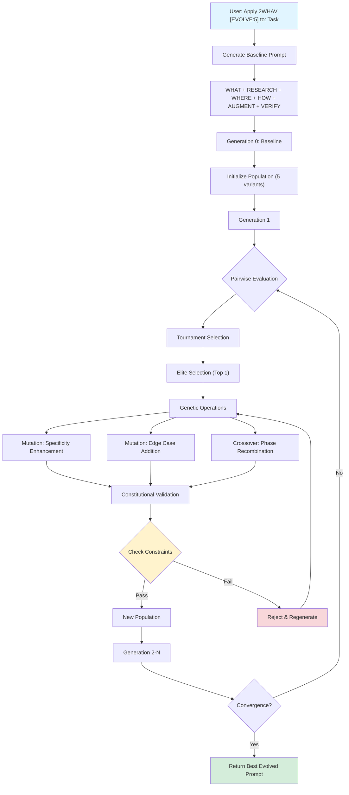

# 2WHAV Usage Instructions

**A guide for humans on how to use the 2WHAV framework with LLMs**

---

## 🎯 Quick Start

Point your LLM to this repository and request structured prompts:

```
"Read the 2WHAV framework from [GitHub URL] and use it to structure prompts for me"
```

Then:

```
"Apply 2WHAV [MODE] to: [YOUR TASK]"
```

The LLM will generate a complete, unambiguous specification following the framework.

---

## 📖 Usage by LLM Type

### Option 1: Web-Enabled LLMs (ChatGPT Plus, Claude Pro, etc.)

**Best for:** LLMs with web browsing or GitHub access

**Step 1:** Share the repository link

```
"Read the 2WHAV framework from https://github.com/[your-username]/2WHAV"
```

**Step 2:** The LLM will automatically:

- Read `README.md` (framework overview)
- Navigate to `skills/` directory
- Load only the skill files needed for your requested mode

**Step 3:** Request a structured prompt

```
"Apply 2WHAV [STANDARD] to: Create a traffic light FSM with emergency override"
```

**Result:** Complete specification with WHAT, WHERE, HOW, VERIFY phases

---

### Option 2: LLMs Without Web Access

**Best for:** Basic ChatGPT, local LLMs, API-only models

**Step 1:** Use raw GitHub content links

```
"Read these files:
- https://raw.githubusercontent.com/[user]/2WHAV/[branch]/README.md
- https://raw.githubusercontent.com/[user]/2WHAV/[branch]/skills/00-controller.md
- https://raw.githubusercontent.com/[user]/2WHAV/[branch]/skills/01-mode-analyzer.md"
```

**Step 2:** Add skill files based on mode

**For MINIMAL:**

```
- skills/02-what-generator.md
- skills/05-how-generator.md
- skills/07-verify-generator.md
```

**For STANDARD:**

```
- skills/02-what-generator.md
- skills/04-where-generator.md
- skills/05-how-generator.md
- skills/07-verify-generator.md
```

**For FULL:**

```
- skills/02-what-generator.md
- skills/03-research-generator.md
- skills/04-where-generator.md
- skills/05-how-generator.md
- skills/06-augment-generator.md
- skills/07-verify-generator.md
```

**Step 3:** Request your structured prompt

---

### Option 3: IDE-Integrated LLMs (Cursor, GitHub Copilot, etc.)

**Best for:** Claude in Cursor, Copilot in VS Code, Windsurf, etc.

**Step 1:** Clone the repository locally

```bash
git clone https://github.com/[your-username]/2WHAV
cd 2WHAV
```

**Step 2:** Tell your IDE's LLM

```
"Use the 2WHAV framework in this repository to structure my task"
```

**Step 3:** Request your prompt

```
"Apply 2WHAV [FULL] to: Production-ready rate limiter with circuit breaker"
```

**Advantage:** The LLM has direct file system access and can load skills on-demand

---

## 📂 Repository Structure

### Entry Point

- **Start here:** `README.md` - Framework overview and quick reference
- **Architecture:** `skills/README.md` - How skills work together

### Core Skills

- `skills/00-controller.md` - Orchestration logic
- `skills/01-mode-analyzer.md` - Phase selection based on mode

### Phase Generators (Loaded on Demand)

- `skills/02-what-generator.md` - WHAT phase (always)
- `skills/03-research-generator.md` - RESEARCH phase (FULL only)
- `skills/04-where-generator.md` - WHERE phase (conditional)
- `skills/05-how-generator.md` - HOW phase (always)
- `skills/06-augment-generator.md` - AUGMENT phase (optional)
- `skills/07-verify-generator.md` - VERIFY phase (always)

---

## 🎨 Mode Selection Guide

| Mode         | When to Use                   | Example Tasks                                   | Evolution             |
| ------------ | ----------------------------- | ----------------------------------------------- | --------------------- |
| **MINIMAL**  | Simple functions, no state    | CSV parser, email validator, string formatter   | No                    |
| **STANDARD** | Systems with states/decisions | FSM, retry logic, workflow engine               | No                    |
| **FULL**     | Production systems            | Rate limiter, caching layer, distributed system | Yes (3-5 generations) |

**Not sure?** Use **STANDARD** as default, or let the LLM decide by omitting the mode:

```
"Apply 2WHAV to: [YOUR TASK]"  # Defaults to FULL
```

**NEW in v2.1:** FULL mode includes **evolutionary refinement** - the LLM iteratively improves the baseline prompt through 3-5 generations of mutations and crossover operations, enhancing specificity, completeness, and clarity.

---

## 🧬 Evolution Configuration (FULL Mode)

### Basic Syntax

**Standard FULL mode (with default evolution):**
```
Apply 2WHAV [FULL] to: [YOUR TASK]
```
- Uses default 3-5 generations
- Automatic convergence detection

**Explicit evolution control:**
```
Apply 2WHAV [EVOLVE:N] to: [YOUR TASK]
```
- `N` = number of generations (e.g., `EVOLVE:3`, `EVOLVE:5`, `EVOLVE:10`)
- Equivalent to `[FULL]` mode with controlled iteration count

### Evolution Flow Diagram



### Evolution Parameters

| Parameter | Syntax | Description | Example |
|-----------|--------|-------------|---------|
| **Default** | `[FULL]` | Automatic (3-5 generations) | `Apply 2WHAV [FULL] to: Rate limiter` |
| **Explicit** | `[EVOLVE:N]` | Exactly N generations | `Apply 2WHAV [EVOLVE:5] to: Rate limiter` |
| **Light** | `[EVOLVE:3]` | Quick refinement (3 gen) | For faster iteration |
| **Standard** | `[EVOLVE:5]` | Balanced optimization | Recommended default |
| **Deep** | `[EVOLVE:10]` | Thorough exploration | For complex systems |

### How Evolution Works

**Step-by-Step Process:**

1. **Baseline Generation** (Generation 0)
   - Standard 2WHAV phases assembled
   - Forms the starting point for evolution

2. **Population Initialization**
   - LLM generates 4 variations through mutations
   - Each targets different improvements

3. **Pairwise Tournament**
   - LLM judges: "Which prompt is better: A or B?"
   - Criteria: Specificity, Completeness, Clarity, Executability
   - Ranks all variants by win rate

4. **Selection**
   - Elite: Top 1 always survives
   - Parents: Top 2-3 selected for breeding

5. **Genetic Operations** (LLM-Prompted)
   - **Mutation Types:**
     - "Make this constraint more measurable"
     - "Add a missing edge case to VERIFY"
     - "Expand persona with relevant expertise"
   - **Crossover:**
     - "Merge the best aspects of these two prompts"

6. **Constitutional Validation**
   - LLM checks: "Does this preserve 2WHAV structure?"
   - Rejects mutations that violate constraints
   - Ensures WHAT/WHERE/HOW/AUGMENT/VERIFY remain intact

7. **Convergence Check**
   - Stop if best prompt wins on 4/5 criteria vs baseline
   - Stop if reached generation limit
   - Stop if no improvement for 2 generations

8. **Output**
   - Returns highest-ranked evolved prompt

### Usage Examples

**Example 1: Quick Refinement**
```
Apply 2WHAV [EVOLVE:3] to: CSV parser with error handling
```
- 3 generations of mutations
- Fast iteration for simpler tasks

**Example 2: Standard Production**
```
Apply 2WHAV [EVOLVE:5] to: Production-ready rate limiter with Redis
```
- 5 generations (recommended)
- Balances quality vs. time

**Example 3: Deep Optimization**
```
Apply 2WHAV [EVOLVE:10] to: Distributed consensus algorithm with Byzantine fault tolerance
```
- 10 generations for complex systems
- Maximum exploration of prompt space

### Evolution vs. Standard Modes

| Mode | Syntax | Evolution | Generations | Use Case |
|------|--------|-----------|-------------|----------|
| **MINIMAL** | `[MINIMAL]` | No | 0 | Simple functions |
| **STANDARD** | `[STANDARD]` | No | 0 | State machines |
| **FULL** | `[FULL]` | Yes (auto) | 3-5 | Production systems |
| **EVOLVE:N** | `[EVOLVE:3/5/10]` | Yes (explicit) | N | Controlled evolution |

### Token Cost Estimation

| Configuration | Framework Load | Evolution Execution | Total | Result Quality |
|---------------|----------------|---------------------|-------|----------------|
| `[FULL]` default | ~15.5k tokens | ~5-12k tokens | ~20-27k | High |
| `[EVOLVE:3]` | ~15.5k tokens | ~5-8k tokens | ~20-23k | Good |
| `[EVOLVE:5]` | ~15.5k tokens | ~8-12k tokens | ~23-27k | Very High |
| `[EVOLVE:10]` | ~15.5k tokens | ~15-25k tokens | ~30-40k | Maximum |

**Note:** Evolution costs are during execution (LLM calls for evaluation/mutation), not framework loading.

---

## 💡 Best Practices

### 1. Be Specific in Your Task Description

❌ **Vague:**

```
"Create a state machine"
```

✅ **Specific:**

```
"Create a traffic light FSM with 3 states (GREEN 30s, YELLOW 5s, RED 30s) and emergency override"
```

### 2. Include Domain Context

❌ **Generic:**

```
"Apply 2WHAV to: Create a cache"
```

✅ **With Context:**

```
"Apply 2WHAV [FULL] to: Create production-ready LRU cache for REST API with 1000 req/min, TTL support, and circuit breaker"
```

### 3. Specify Constraints

```
"Apply 2WHAV [STANDARD] to: Retry function
Constraints: Max 3 attempts, exponential backoff (100ms, 200ms, 400ms), ES5 compatible"
```

### 4. Request Examples

```
"Apply 2WHAV [MINIMAL] to: CSV parser
Also provide a concrete example with the generated prompt"
```

---

## 🔄 Typical Workflow

### Example Session

```
You: "Read the 2WHAV framework from [GitHub URL]"

LLM: "I've read the framework. It uses WHAT-WHERE-HOW-AUGMENT-VERIFY phases
     to create unambiguous specifications. Ready to use it!"

You: "Apply 2WHAV [STANDARD] to: Connection manager with states
     DISCONNECTED, CONNECTING, CONNECTED, ERROR. Must handle reconnection
     with exponential backoff."

LLM: [Generates structured prompt with:]
     - WHAT: Objective (with expert persona)
     - WHERE: FSM architecture with 4 states and priority hierarchy
     - HOW: Syntax rules and API contract
     - VERIFY: Validation checklist

You: [Use the generated prompt to create the actual code]
```

---

## 🚀 Advanced Usage

### Custom Phase Combinations

```
"Apply 2WHAV [WHAT + HOW + AUGMENT + VERIFY] to: Optimized JSON parser"
```

This loads only the specified phases, skipping WHERE.

### Multiple Tasks

```
"Apply 2WHAV [MINIMAL] to these tasks:
1. Email validator
2. Phone number formatter
3. URL parser"
```

The LLM will generate three separate structured prompts.

### Iterative Refinement

```
"Apply 2WHAV [STANDARD] to: User authentication FSM"

[Review generated prompt]

"Add to the WHERE phase: password reset flow as a separate state"
```

---

## 📊 Token Efficiency

The framework is designed for mid-range LLMs (32k+ context):

| Mode         | Skills Loaded | Tokens Used | Free Space (32k) | Evolution |
| ------------ | ------------- | ----------- | ---------------- | --------- |
| **MINIMAL**  | 4 files       | ~5,000      | 27k (84%)        | No        |
| **STANDARD** | 5 files       | ~7,000      | 25k (78%)        | No        |
| **FULL**     | 9 files       | ~15,500     | 16.5k (52%)      | Yes       |

**Key benefit:** Even FULL mode with evolution leaves 50%+ of context for your actual work.

**Evolution Cost:** The EVOLUTION phase uses ~5-12k additional tokens during execution for LLM calls (pairwise comparisons, mutations, validation), but this happens after framework loading and produces a refined prompt that generates better code.

---

## 🤔 FAQ

### Q: Which file should I link to first?

**A:** Always start with the repository root or `README.md`. The LLM will automatically navigate to other files.

### Q: Can the LLM navigate all documents?

**A:** Yes, if the LLM has:

- Web browsing capability (ChatGPT Plus, Claude Pro)
- GitHub integration (some platforms)
- File system access (Cursor, VS Code Copilot)

### Q: Do I need to load all skill files?

**A:** No! The framework uses lazy loading. Only skills needed for your selected mode are loaded.

### Q: What if my LLM doesn't support GitHub links?

**A:** Copy-paste the contents of `README.md` and relevant skill files directly into your conversation.

### Q: Can I modify the framework for my domain?

**A:** Yes! Fork the repository and:

1. Add domain-specific skill variations in `skills/`
2. Keep each skill under 300 lines
3. Follow the existing skill structure (Metadata → Input → Output → Logic → Examples)

### Q: How do I know if it's working?

**A:** The LLM should generate a structured prompt with clear sections:

- `## WHAT: Objective` (with persona definition)
- `## RESEARCH: Knowledge Expansion` (FULL mode only)
- `## WHERE: Virtualization` (if states/decisions present)
- `## HOW: Generation` (syntax rules)
- `## HOW: Interface` (API contract)
- `## AUGMENT: Optimization` (FULL mode only)
- `## VERIFY: Validation` (checklist)
- `## EVOLUTION: Iterative Refinement` (FULL mode only - meta-process)

### Q: How does the EVOLUTION phase work in FULL mode?

**A:** EVOLUTION operates as a meta-process after all phases are assembled:

1. **Baseline Generation:** Standard 2WHAV prompt created
2. **Population Init:** LLM generates 4 variations through prompted mutations
3. **Pairwise Evaluation:** LLM judges which prompts are better (no code execution needed)
4. **Selection:** Top prompts survive based on tournament results
5. **Genetic Operations:** LLM performs mutations (specificity enhancement, edge case addition) and crossover
6. **Validation:** Constitutional check ensures 2WHAV structure preserved
7. **Iteration:** Repeat for 3-5 generations or until convergence
8. **Output:** Best evolved prompt replaces baseline

**Key Feature:** Works for ANY task (code, design, analysis, documentation) because fitness is measured through LLM-as-a-Judge pairwise comparisons, not code execution.

---

## 📝 Example: Complete Usage

**Scenario:** You want to create a production-ready rate limiter

```
You: "Read the 2WHAV framework from https://github.com/fra00/2WHAV"

LLM: [Reads README.md and skills/README.md]

You: "Apply 2WHAV [FULL] to: Production-ready API rate limiter using
     sliding window algorithm. Must handle 10,000 req/sec, support
     distributed deployment with Redis, and include circuit breaker for
     overload protection."

LLM: [Loads skills: 00-controller, 01-mode-analyzer, 02-what, 03-research,
     04-where, 05-how, 06-augment, 07-verify, 08-evolution]

LLM: [Generates baseline specification:]

## WHAT: Objective

### Persona
You are a **Distributed Systems Architect specializing in rate limiting**
with deep expertise in:
- **Performance Engineering:** High-throughput systems (10k+ req/sec)...
- **Distributed Algorithms:** Sliding window, token bucket, consensus...
- **Production Operations:** Circuit breakers, monitoring, Redis clustering...

Your approach: Design for failure, optimize for the common case...
Your strengths: Preventing race conditions, ensuring consistency...

### Task
Your task is to create a production-ready rate limiter that:
- Handles 10,000 requests/second with <10ms p99 latency
- Uses sliding window algorithm for accuracy
- Supports distributed deployment with Redis backend
- Includes circuit breaker for graceful degradation
...

## RESEARCH: Knowledge Expansion

**RESEARCH DIRECTIVE:** Research current best practices for high-performance
rate limiters...

[Complete sections for WHERE, HOW, AUGMENT, VERIFY follow]

## EVOLUTION: Iterative Refinement

[LLM performs evolutionary refinement:]

Generation 0 (Baseline): Initial prompt assembled
Generation 1: Mutation adds specific Redis commands (ZADD, ZREMRANGEBYSCORE)
Generation 2: Crossover merges timeout strategies, adds edge case for clock skew
Generation 3: Mutation sharpens "10,000 req/sec" to "p99 latency < 5ms at 10k req/sec"
Convergence: Best prompt wins on 4/5 criteria vs baseline

[Final evolved prompt with enhanced specificity, completeness, and clarity]
```

**Result:** You now have an evolved, optimized specification that is more specific, complete, and executable than the baseline!

---

## 🎓 Learning Path

1. **Start Simple:** Try MINIMAL mode with a basic function
2. **Add Complexity:** Use STANDARD for a simple FSM
3. **Go Production:** Use FULL for a complete system
4. **Customize:** Fork and adapt for your specific domain

---

## 🔗 Resources

- **Repository:** [GitHub URL]
- **Framework Overview:** `README.md`
- **Architecture Details:** `skills/README.md`
- **Phase Generators:** `skills/02-07-*.md`

---

## ⚙️ For Contributors

Want to extend 2WHAV for your domain?

1. Fork the repository
2. Create new skill files in `skills/` (e.g., `02-what-web3-generator.md`)
3. Keep skills under 300 lines (~2k tokens)
4. Follow the structure: Metadata → Input → Output → Logic → Examples
5. Update `skills/README.md` with your additions
6. Submit a PR

---

**Version:** 2.1 (Evolutionary Enhancement)
**Last Updated:** November 2025
**Maintained by:** [fra00](https://github.com/fra00)

---

_2WHAV: Making LLM specifications unambiguous and evolved, one prompt at a time._
