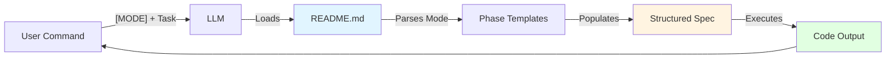

# 2WHAV Framework

> **A rigorous Prompt Engineering framework that transforms minimal specifications into executable contracts.**

[](https://github.com/fra00/2WHAV)
[](LICENSE)

---

## 📘 Documentation Navigation

| Document                                        | Audience                       | Purpose                                                         | Read Time |
| ----------------------------------------------- | ------------------------------ | --------------------------------------------------------------- | --------- |
| **[📖 Complete Guide](GUIDE.md)**               | 👤 Humans (New Users)          | Philosophy, theory, strategic decisions, when to use each phase | 25 min    |
| **📄 README.md** _(this file)_                  | 🤖 LLMs + 👤 Expert Developers | Executable tool specification, templates, rules                 | 15 min    |
| **💡 Examples**                                 | 👤 + 🤖 Both                   | Production-ready implementations with analysis                  |           |
| ↳ [🚦 Traffic Light](examples/traffic-light.md) | 👤 + 🤖                        | FSM with XState for a time-based system with priorities.        | ~8 min    |
| ↳ [🧩 Tic-Tac-Toe Bot](examples/tic-tac-toe.md) | 👤 + 🤖                        | Unbeatable game AI with complex defensive/offensive logic.      | ~10 min   |

> **🆕 New to 2WHAV?** Start with the [Complete Guide](GUIDE.md) to understand the philosophy, decision-making process, and modularity principles before using this tool.

---

## 🤖 For LLMs: Executable Tool Specification

### Tool Identity

**Name:** 2WHAV (What-Where-How-Augment-Verify)  
**Type:** Prompt Engineering Framework ("Tool as Prompt")  
**Version:** 1.0  
**Purpose:** Transform vague user requests into rigorous, deterministic code specifications.

### Execution Protocol

When you receive a command in the format:

```
Apply 2WHAV [MODE] to: [TASK DESCRIPTION]
```

**You MUST:**

1. **Parse MODE** to determine which phases to include (see Mode Definitions below)
2. **Generate Structured Prompt** following the phase templates in this document
3. **Populate Templates** with specifications derived from [TASK DESCRIPTION]
4. **Execute Generated Prompt** to produce final code/specification

---

## 📋 Mode Definitions

| Mode             | Phases Included                       | Formula       |
| ---------------- | ------------------------------------- | ------------- |
| **`[MINIMAL]`**  | WHAT + HOW + VERIFY                   | W+H+V         |
| **`[STANDARD]`** | WHAT + WHERE + HOW + VERIFY           | W+Wr+H+V      |
| **`[FULL]`**     | WHAT + WHERE + HOW + AUGMENT + VERIFY | W+Wr+H+A+V    |
| **Custom**       | Any combination                       | W+H+A+V, etc. |

> ⚠️ **CRITICAL RULE:** If MODE is not specified, use mode [FULL]

> 📖 **For detailed strategic guidance:** See [Mode Selection Guide](GUIDE.md#when-to-use-2whav) in GUIDE.md

---

## 🔄 Framework Flow



**Phases Execute in This Order:**

```
WHAT → WHERE (optional) → HOW (Generation + Interface) → AUGMENT (optional) → VERIFY
```

---

## 🎯 Phase 1: WHAT (Objective) [ALWAYS REQUIRED]

> **Purpose:** Define the exact output, constraints, and main purpose.

### Components to Extract/Define

| Component                   | What to Specify               | Example                                              |
| --------------------------- | ----------------------------- | ---------------------------------------------------- |
| **LLM Role**                | Domain-specific expertise     | "You are an expert in state machines"                |
| **Task**                    | Precise, measurable objective | "Create FSM for traffic light with 3 states"         |
| **Output Format**           | Exact structure required      | "Single JavaScript object literal `const x = {...}`" |
| **Operational Constraints** | Priorities, requirements      | "Priority: Safety > Performance > Simplicity"        |

### Template

```markdown
## WHAT: Objective

### Role and Task

You are a [DOMAIN EXPERT]. Your task is to [SPECIFIC TASK].

### Expected Output

The output MUST be [EXACT FORMAT].
[Additional format specifications]

### Operational Constraints

- Priority: [X > Y > Z]
- [Constraint 1: e.g., "System must be fail-safe"]
- [Constraint 2: e.g., "Compatible with ES5"]

### Index

| Phase                              | Purpose                | Critical Elements                |
| ---------------------------------- | ---------------------- | -------------------------------- |
| [WHERE](#where)                    | Control architecture   | [If applicable: FSM, priorities] |
| [HOW: Generation](#how-generation) | Syntax rules           | [Language, forbidden patterns]   |
| [HOW: Interface](#how-interface)   | API contract           | [Available functions only]       |
| [AUGMENT](#augment)                | Strategic intelligence | [If applicable: optimizations]   |
| [VERIFY](#verify)                  | Validation             | [Success criteria]               |
```

### Population Rules

**MANDATORY:**

- Derive role from task domain (avoid generic "expert programmer")
- Specify exact output format (function? class? object literal?)
- List all constraints mentioned in task or implied by domain

**FORBIDDEN:**

- Vague outputs like "working code"
- Missing format specifications
- Omitting critical constraints

---

## 🏗️ Phase 2: WHERE (Virtualization) [CONDITIONAL]

> **Purpose:** Define control architecture, decision priorities, and execution flow.

### Include WHERE If Task Has:

- ✅ States and transitions (FSM, State Machine)
- ✅ Conditional logic with priorities ("if X then Y, else Z")
- ✅ Decision tree or behavior tree
- ✅ Multiple evaluation priorities
- ✅ Phrases like "when X happens" or "prioritize Y over Z"

### Omit WHERE If Task Is:

- ❌ Pure functional (input → processing → output, no state)
- ❌ Linear flow (A → B → C with no branching)
- ❌ Single responsibility with no decisions

### What to Define

| Aspect                 | Specification                  | Output                      |
| ---------------------- | ------------------------------ | --------------------------- |
| **Control Model**      | FSM / Behaviour Tree / Ruleset | Explicit architecture name  |
| **States**             | All possible states            | List with descriptions      |
| **Transitions**        | State → State mappings         | With trigger conditions     |
| **Priority Hierarchy** | Inviolable evaluation order    | Numbered list (1 = highest) |
| **Data Flow**          | How context is built/passed    | Function call sequence      |
| **Execution Cycle**    | Step-by-step process           | Ordered operations          |

### Template

```markdown
## WHERE: Virtualization

### Control Architecture

The system implements a [FSM / BEHAVIOUR TREE / RULESET].

### States and Transitions

| State     | Triggers    | Transitions To | Priority       |
| --------- | ----------- | -------------- | -------------- |
| [STATE_1] | [Condition] | [STATE_2]      | [HIGH/MED/LOW] |
| [STATE_2] | [Condition] | [STATE_3]      | [HIGH/MED/LOW] |

### Priority Hierarchy (INVIOLABLE EVALUATION ORDER)

The system MUST evaluate decisions in this order:

| Order | Priority Level | Focus                       | Example Conditions             |
| ----- | -------------- | --------------------------- | ------------------------------ |
| 1     | **EMERGENCY**  | Critical safety/termination | Game over, collision imminent  |
| 2     | **TACTICAL**   | Strategic optimization      | Block opponent, find best path |
| 3     | **STANDARD**   | Normal operation            | Default behavior, idle state   |

**CRITICAL:** Transitions at higher priority levels are evaluated BEFORE lower levels. This order is inviolable.

### Execution Cycle

1. `buildContext(api, externalData)` → Constructs decision context
2. `evaluateTransitions(context)` → Checks conditions in priority order (1→2→3)
3. `executeStateAction(api, context)` → Performs current state's action
4. [Repeat from step 1]

### Data Flow

- **Input:** `api` (system interface) + `externalData` (external state)
- **Context Construction:** `buildContext()` populates context object
- **Decision Making:** Transitions receive `context` as input
- **Action Execution:** Current state uses `context` to decide action
```

### Population Rules

**MANDATORY if WHERE is included:**

- Identify ALL states from task description
- Define transitions with clear trigger conditions
- Specify priority hierarchy with explicit ordering
- Document execution cycle (what calls what, in what order)

**FORBIDDEN:**

- Ambiguous priorities ("important" vs "very important")
- Missing states or transitions
- Undefined data flow between components

---

## ⚙️ Phase 3: HOW - Part A (Generation Rules) [ALWAYS REQUIRED]

> **Purpose:** Define syntactic rules, forbidden patterns, and exact scaffolding.

### What to Specify

| Category               | Specification Type  | Example                                             |
| ---------------------- | ------------------- | --------------------------------------------------- |
| **Syntax Rules**       | MANDATORY patterns  | "Use `function() {}`, FORBIDDEN: `() => {}`"        |
| **Output Structure**   | Exact format        | "Single object literal: `const name = {...}`"       |
| **Naming Conventions** | Required style      | "camelCase for functions, UPPER_CASE for constants" |
| **Compatibility**      | Language version    | "ES5 only (no let/const/arrow functions)"           |
| **Access Patterns**    | How to call helpers | "Via parent object: `obj.helper()`, NOT `helper()`" |

### Template

```markdown
## HOW: Generation (Syntax Rules and Scaffolding)

### Mandatory Rules

> ⚠️ Use prescriptive language: MANDATORY, FORBIDDEN, MUST, MUST NOT

| Rule Category         | Requirement                | ✅ Correct          | ❌ Incorrect           |
| --------------------- | -------------------------- | ------------------- | ---------------------- |
| **Function Syntax**   | MANDATORY: `function() {}` | `function foo() {}` | `const foo = () => {}` |
| **Output Format**     | MANDATORY: Object literal  | `const x = { ... }` | `class X { ... }`      |
| **Variable Scope**    | MANDATORY: Explicit access | `obj.method()`      | `method()`             |
| **[Domain-Specific]** | [Custom rule]              | [Example]           | [Counter-example]      |

### Forbidden Patterns

- ❌ Arrow functions (`=>`) [if ES5 target]
- ❌ `let` / `const` keywords [if ES5 target]
- ❌ Global function calls not in API contract
- ❌ Direct property mutation without methods
- ❌ [Domain-specific forbidden patterns]

### Scaffolding (EXACT TEMPLATE)

\`\`\`[LANGUAGE]
[Provide complete, copy-pasteable template]

Example:
const systemName = {
// ===== SECTION A: CONFIGURATION =====
initialState: '[INITIAL_STATE]',
memory: { /_ persistent data _/ },
constants: { /_ immutable values _/ },

// ===== SECTION B: CONTEXT BUILDER =====
buildContext: function(api, externalData) {
// MUST return object with all context fields
return {
// [List expected context fields]
};
},

// ===== SECTION C: MAIN LOGIC =====
[mainFunction]: function(api, externalData) {
const context = systemName.buildContext(api, externalData);
// [Implementation logic]
},

// ===== SECTION D: HELPERS =====
\_helperFunction: function([params]) {
// [Helper implementation]
return [result];
}
};
\`\`\`

### Scaffolding Population Rules

- **MUST** populate all sections (A, B, C, D)
- **MUST** implement all helper functions referenced in main logic
- **MUST** follow naming conventions specified above
- **MUST NOT** add sections or functions not in template
```

### Population Rules

**MANDATORY:**

- Include language-specific syntax rules
- Provide complete scaffolding (no placeholders like "// TODO")
- List ALL forbidden patterns for the target environment
- Use strong prescriptive language (MANDATORY, FORBIDDEN)

**FORBIDDEN:**

- Generic rules like "write clean code"
- Incomplete scaffolding with "..." or "TODO"
- Ambiguous rules like "prefer X over Y" (use MANDATORY/FORBIDDEN)

---

## 🔌 Phase 4: HOW - Part B (Interface Contract) [ALWAYS REQUIRED]

> **Purpose:** Document the ONLY functions the code can use to interact with the external system.

### Fundamental Principle

**The generated code can ONLY call functions explicitly documented in this section.**  
Any function not listed here MUST NOT appear in the generated code.

### Template

```markdown
## HOW: Interface (API Contract)

### Available Functions

The code interacts EXCLUSIVELY through the `api` object. No other functions or globals are available.

| Function               | Input        | Output | Behavior    | Critical Notes                          |
| ---------------------- | ------------ | ------ | ----------- | --------------------------------------- |
| `api.function1()`      | `type`       | `type` | Description | Synchronous/Async, Can fail/Never fails |
| `api.function2(param)` | `type`       | `type` | Description | Range limits, Error conditions          |
| `api.function3(x, y)`  | `type, type` | `type` | Description | Side effects, State changes             |

### API Contract Rules

- ✅ All API functions are [synchronous/asynchronous - specify]
- ✅ `api` object is globally available in the execution context
- ✅ Functions marked "Can fail" may throw exceptions or return error values
- ❌ NO other functions exist (no `fetch`, `XMLHttpRequest`, `console.*`, etc.)
- ❌ NO direct DOM access or browser APIs
- ❌ [Add domain-specific restrictions]

### Context Construction Contract

If WHERE phase is present, specify how context is built:

| Context Field    | Type   | Source           | Example Value | Required |
| ---------------- | ------ | ---------------- | ------------- | -------- |
| `context.field1` | `type` | `api.getX()`     | `value`       | YES/NO   |
| `context.field2` | `type` | `externalData.y` | `value`       | YES/NO   |

**buildContext() MUST populate all fields marked as Required.**

### Error Handling Requirements

- Functions marked "Can fail" MUST be wrapped in try/catch
- [Specify fallback behavior for critical failures]
- [Specify if any functions have retry logic]
```

### Population Rules

**MANDATORY:**

- List EVERY function the code needs to call
- Specify exact input/output types
- Document error conditions and failure modes
- Mark synchronous vs asynchronous operations
- If WHERE exists, define context construction contract

**FORBIDDEN:**

- Vague descriptions like "gets data"
- Missing error behavior specifications
- Unlisted functions appearing in generated code
- Assuming functions exist without documentation

---

## 🚀 Phase 5: AUGMENT (Strategic Intelligence) [CONDITIONAL]

> **Purpose:** Request advanced logic beyond minimum requirements: optimization, resilience, intelligence.

### Include AUGMENT If Task Needs:

- ✅ Performance optimization (caching, algorithms, efficiency)
- ✅ Error resilience (retry, fallback, graceful degradation)
- ✅ Strategic intelligence (heuristics, risk assessment, adaptation)
- ✅ Production-level robustness
- ✅ User explicitly requests optimized/intelligent solution

### Omit AUGMENT If Task Is:

- ❌ Prototype or proof-of-concept
- ❌ Educational example
- ❌ User only needs basic functionality

### Augmentation Categories

| Category         | Focus                          | Example Implementations                                     |
| ---------------- | ------------------------------ | ----------------------------------------------------------- |
| **OPTIMIZATION** | Efficiency, speed, memory      | Caching, lookup tables, O(n) algorithms, lazy evaluation    |
| **RESILIENCE**   | Error handling, recovery       | Exponential backoff, circuit breaker, retry with timeout    |
| **INTELLIGENCE** | Decision quality, adaptability | Risk assessment, opportunity cost, pattern recognition      |
| **PREVENTIVE**   | Anticipate problems            | Anomaly detection, resource monitoring, deadlock prevention |

### Template

```markdown
## AUGMENT: Augmentation (Strategic Directives)

**CREATIVITY DIRECTIVE:**  
The implementation MUST include logic beyond the basic requirements specified in WHAT.

### Required Augmentations

#### 1. OPTIMIZATION

**Directive:** [Specific optimization for this domain]

Examples:

- For data processing: Implement streaming to handle large datasets
- For pathfinding: Add caching for previously computed paths
- For API calls: Implement request deduplication and response caching
- For algorithms: Use O(n log n) instead of O(n²) where applicable

**Implementation requirement:** [Specific technique to implement]

#### 2. RESILIENCE

**Directive:** Implement comprehensive error handling and recovery.

MANDATORY mechanisms:

- **Retry Logic:** [Specify: exponential backoff, max attempts, conditions]
- **Fallback Strategy:** [Specify: what to do when all retries fail]
- **Timeout Handling:** [Specify: timeout duration, timeout behavior]
- **Validation:** [Specify: input validation, output validation]

**Implementation requirement:** [Specific error scenarios to handle]

#### 3. INTELLIGENCE

**Directive:** Add strategic decision-making beyond basic logic.

Required intelligence:

- **[Domain-Specific Heuristic]:** [Description and purpose]
- **[Risk Assessment]:** [What risks to evaluate and how]
- **[Adaptation]:** [How system should adapt to different conditions]

**Implementation requirement:** [Specific helper function or logic to add]

### Domain-Specific Augmentations

[Add any domain-specific enhancements]

Examples:

- For game AI: Implement minimax with alpha-beta pruning
- For network code: Add circuit breaker pattern
- For state machines: Add deadlock detection and prevention
- For data processing: Add memory-efficient chunking
```

### Population Rules

**MANDATORY if AUGMENT is included:**

- Specify at least 2 categories (optimization + resilience, or optimization + intelligence)
- Provide concrete implementation requirements, not vague suggestions
- Tie augmentations to the specific domain/task
- Specify which helper functions or patterns to add

**FORBIDDEN:**

- Generic statements like "make it better"
- Augmentations not relevant to the domain
- Conflicting requirements (e.g., "optimize for speed" + "use defensive copying everywhere")

---

## ✅ Phase 6: VERIFY (Validation Checklist) [ALWAYS REQUIRED]

> **Purpose:** Final validation checklist to ensure generated code meets all requirements.

### Checklist Function

**Note for LLMs:** This checklist influences the generation process by reinforcing critical constraints. It is NOT executed post-generation autonomously. The user will validate the output manually using this checklist.

### Template

```markdown
## VERIFY: Verification

Before providing the output, verify the code satisfies ALL requirements below:

### ✅ Structural Compliance (WHAT Phase)

- [ ] Output format matches WHAT specification exactly?
- [ ] [Role-appropriate complexity level]?
- [ ] All constraints from WHAT are satisfied?
- [ ] Scaffolding is complete with no placeholders/TODOs?

### ✅ Architectural Compliance (WHERE Phase - if applicable)

- [ ] All states from WHERE are implemented?
- [ ] Transitions follow the specified triggers?
- [ ] Priority hierarchy is respected: [Priority 1] → [Priority 2] → [Priority 3]?
- [ ] Execution cycle matches WHERE specification?
- [ ] Context construction follows the contract?

### ✅ Syntactic Compliance (HOW: Generation)

- [ ] All MANDATORY syntax rules are followed?
- [ ] All FORBIDDEN patterns are absent?
- [ ] Naming conventions are consistent?
- [ ] Scaffolding sections (A, B, C, D) are all populated?
- [ ] Helper functions are accessible via [specified access pattern]?

### ✅ Interface Compliance (HOW: Interface)

- [ ] Code uses ONLY functions documented in Interface section?
- [ ] No undocumented API calls appear in code?
- [ ] Error handling is present for functions marked "Can fail"?
- [ ] Context construction populates all required fields?

### ✅ Augmentation Compliance (AUGMENT Phase - if applicable)

- [ ] Optimization logic is implemented as specified?
- [ ] Resilience mechanisms (retry/fallback/timeout) are present?
- [ ] Intelligence/heuristics are added as required?
- [ ] Domain-specific augmentations are included?

### ✅ Domain-Specific Validation

[Add any domain-specific checks]

Examples:

- [ ] For FSM: Terminal states have no outgoing transitions?
- [ ] For game AI: Defense is prioritized over offense as specified?
- [ ] For async code: All Promises are properly awaited?

### Final Assertion

- [ ] **The code can be executed immediately with no modifications?**
```

### Population Rules

**MANDATORY:**

- Include checks for ALL phases that were populated
- Make checks specific and testable (not vague like "is it good?")
- Use checkbox format for each check
- Include domain-specific validation criteria
- End with final assertion about executability

**FORBIDDEN:**

- Generic checks like "code quality is good"
- Checks for phases that were not included
- Ambiguous criteria that can't be objectively verified

---

## 📝 Complete Example: Email Validator

### User Command

```
Apply 2WHAV [MINIMAL] to: Create an async email validator that calls an external API and retries 3 times with exponential backoff
```

### Generated Prompt (by LLM)

````markdown
## WHAT: Objective

### Role and Task

You are an expert in asynchronous JavaScript programming. Your task is to create a robust email validation function that interfaces with an external API and implements retry logic.

### Expected Output

The output MUST be a single async function named `validateEmail` with this exact signature:

```javascript
async function validateEmail(email) { ... }
```
````

The function MUST return an object: `{ valid: boolean, attempts: number, error?: string }`

### Operational Constraints

- Priority: Reliability > Speed
- Must handle network failures gracefully
- Must respect retry limits exactly

---

## HOW: Generation

### Mandatory Rules

| Rule            | Requirement                     | ✅ Correct                            | ❌ Incorrect                             |
| --------------- | ------------------------------- | ------------------------------------- | ---------------------------------------- |
| Function Syntax | MANDATORY: async function       | `async function validateEmail(email)` | `const validateEmail = async (email) =>` |
| Return Type     | MANDATORY: Object with 3 fields | `{ valid, attempts, error }`          | Just `true/false`                        |
| Retry Logic     | MANDATORY: Exactly 3 attempts   | Loop with i < 3                       | Generic retry                            |

### Scaffolding

```javascript
async function validateEmail(email) {
  const delays = [100, 200, 400]; // Exponential backoff
  let attempts = 0;

  for (let i = 0; i < 3; i++) {
    attempts++;
    try {
      // Call API
      // Return on success
    } catch (error) {
      // Log failure
      // Delay before retry (except last attempt)
    }
  }

  // Return failure result
}
```

---

## HOW: Interface

### Available Functions

| Function                | Input    | Output             | Behavior                             | Notes                 |
| ----------------------- | -------- | ------------------ | ------------------------------------ | --------------------- |
| `api.checkEmail(email)` | `string` | `Promise<boolean>` | Validates email via external service | Can reject with Error |

### API Contract

- ✅ Function is asynchronous (returns Promise)
- ✅ Rejects on network errors or invalid responses
- ❌ NO other API functions available

---

## VERIFY: Verification

- [ ] Function signature is exactly `async function validateEmail(email)`?
- [ ] Uses exactly 3 attempts (loop i < 3)?
- [ ] Exponential backoff delays: 100ms, 200ms, 400ms?
- [ ] Returns object with `{ valid, attempts, error? }` structure?
- [ ] Calls ONLY `api.checkEmail()` from Interface?
- [ ] Handles API rejections with try/catch?

```

---

## 🎓 Usage Examples

### Example 1: Minimal Mode
```

Apply 2WHAV [MINIMAL] to: Create a CSV parser function

```
**Result:** Basic parser with WHAT + HOW + VERIFY

---

### Example 2: Standard Mode
```

Apply 2WHAV [STANDARD] to: Create a retry system with states IDLE, TRYING, SUCCESS, FAILED

```
**Result:** FSM with WHERE + state management

---

### Example 3: Full Mode
```

Apply 2WHAV [FULL] to: Create a production-ready rate limiter with sliding window algorithm

```
**Result:** Complete system with WHERE (FSM), AUGMENT (optimization + resilience), full validation

---

### Example 4: Custom Mode
```

Apply 2WHAV [WHAT + HOW + AUGMENT + VERIFY] to: Create an optimized string matcher (skip WHERE, already know it's linear)

```
**Result:** Optimized function without state machine overhead

---

## 🔗 Additional Resources

### For Humans
- 📖 **[Complete Guide](GUIDE.md)** - Deep dive into philosophy, theory, decision-making, and strategic use of 2WHAV
- 💡 **Examples** - Production implementations with detailed analysis: [Traffic Light](examples/traffic-light.md), [Tic-Tac-Toe Bot](examples/tic-tac-toe.md)
- 🌐 **[LLM-First Documentation Principles](https://github.com/fra00/llm-first-documentation)** - Foundation principles

---

## 📊 Information Density Check

This README contains:
- ✅ Complete phase templates (WHAT, WHERE, HOW, AUGMENT, VERIFY)
- ✅ All mandatory/forbidden rules for each phase
- ✅ Exact scaffolding patterns
- ✅ Mode definitions and selection criteria
- ✅ Population rules for every template
- ✅ Execution protocol for LLMs
- ✅ Complete example showing all phases
- ✅ Cross-links to GUIDE.md for theory

**Information preserved from original:** ~95%
**Information moved to GUIDE.md:** Philosophy, "when to use" theory, modularity discussions
**Information made more accessible:** Converted prose to tables, added templates, structured rules

---

## 📄 License

MIT License - see [LICENSE](LICENSE) for details.

---

**Framework Version:** 1.0
**Last Updated:** 2024
**Maintained by:** [fra00](https://github.com/fra00)

---

*This README is written following LLM-First Documentation principles and designed as an executable "Tool as Prompt".*
```
