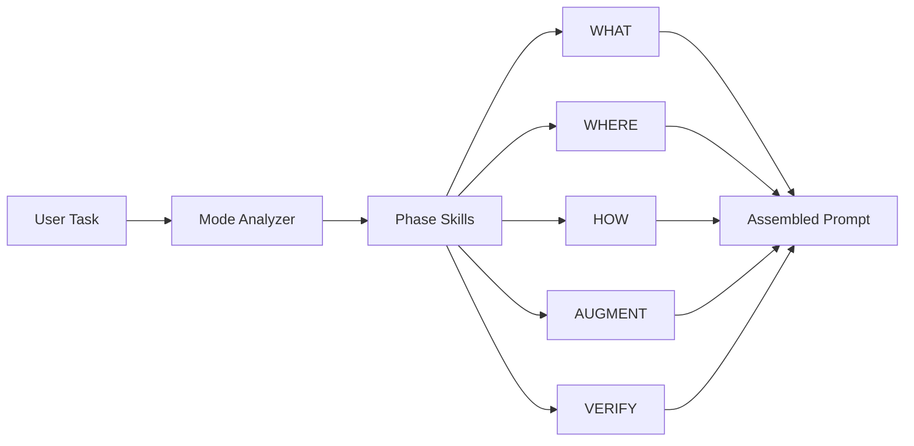

# 2WHAV Framework

> **Transform vague specifications into executable contracts through structured prompt engineering.**

[](https://github.com/fra00/2WHAV)
[](LICENSE)

---

## 🎯 What is 2WHAV?

**2WHAV** (What-Where-How-Augment-Verify) is a rigorous framework that eliminates ambiguity in AI code generation by breaking specifications into modular, precise phases.

### The Problem

```
❌ "Create a retry function that handles errors"
```

Result: LLM guesses retry count, strategy, error types, etc.

### The 2WHAV Solution

```
✅ Apply 2WHAV [STANDARD] to: "Create a retry function"
```

Result: Structured prompt with exact specifications, leaving zero room for interpretation.

---

## 🚀 Quick Start

### For Any LLM (Universal Method)

**Step 1:** Tell your LLM to read this repository:

```
"Read the 2WHAV repository and use it to structure prompts for me"
```

**Step 2:** Request 2WHAV structured prompts:

```
"Apply 2WHAV [MODE] to: [YOUR TASK]"
```

The LLM will:

1. Read relevant skill files from `skills/`
2. Generate a structured prompt using 2WHAV phases
3. Return the complete specification

### For Claude Code Users (Enhanced Method)

Skills are available in `.claude/skills/` for native integration with proactive suggestions and tool access.

---

## 📋 Modes

| Mode         | Phases                                    | Use Case                         | Token Cost |
| ------------ | ----------------------------------------- | -------------------------------- | ---------- |
| **MINIMAL**  | WHAT + HOW + VERIFY                       | Simple functions, utilities      | ~2k        |
| **STANDARD** | WHAT + WHERE + HOW + VERIFY               | State machines, workflows        | ~3.5k      |
| **FULL**     | WHAT + RESEARCH + WHERE + HOW + AUG + VER | Complex systems, production code | ~6k        |

**Default:** FULL (if mode not specified)

---

## 🏗️ Architecture



### Skills Directory

```
skills/
├── 00-controller.md         # Orchestrates workflow
├── 01-mode-analyzer.md      # Determines required phases
├── 02-what-generator.md     # Defines objectives
├── 03-where-generator.md    # Defines control flow
├── 04-how-generator.md      # Defines syntax & API
├── 05-augment-generator.md  # Adds intelligence
└── 06-verify-generator.md   # Creates validation
```

Each skill is **self-contained** and **independently readable**.

---

## 🎓 Usage Examples

### Example 1: Simple Function

```
Apply 2WHAV [MINIMAL] to: Create a CSV parser
```

### Example 2: State Machine

```
Apply 2WHAV [STANDARD] to: Traffic light FSM with emergency override
```

### Example 3: Production System

```
Apply 2WHAV [FULL] to: Rate limiter with sliding window and circuit breaker
```

---

## 📖 How It Works

### Phase Flow

```
WHAT (Objective)
  ↓
WHERE (Control Architecture)  [if needed]
  ↓
HOW (Syntax + API)
  ↓
AUGMENT (Intelligence)  [if needed]
  ↓
VERIFY (Validation)
```

### Phase Descriptions

| Phase        | Required    | Purpose                                             | Output               |
| ------------ | ----------- | --------------------------------------------------- | -------------------- |
| **WHAT**     | Always      | Define persona, role, task, output, constraints     | Objective statement  |
| **RESEARCH** | FULL only   | Expand knowledge, latest practices, pitfalls        | Research directives  |
| **WHERE**    | Conditional | Define FSM/states/priorities for decisional systems | Control architecture |
| **HOW**      | Always      | Define syntax rules, API contract, scaffolding      | Code template        |
| **AUGMENT**  | Optional    | Add optimization, resilience, intelligence          | Strategic directives |
| **VERIFY**   | Always      | Create validation checklist                         | Quality criteria     |

---

## 🔧 For LLM Implementers

### Execution Protocol

When you see: `Apply 2WHAV [MODE] to: [TASK]`

**Do this:**

1. **Read** `skills/00-controller.md` to understand orchestration
2. **Read** `skills/01-mode-analyzer.md` to determine phases for MODE
3. **For each required phase:**
   - Read corresponding skill file
   - Generate that phase using the skill's template
4. **Assemble** all phases into complete structured prompt
5. **Return** the assembled prompt to user

### Critical Rules

- **Only read skills needed for the selected mode** (saves tokens)
- **Follow templates exactly** as specified in each skill
- **Use prescriptive language**: MANDATORY, FORBIDDEN, MUST, MUST NOT
- **Be specific**: No vague terms like "working code" or "good quality"

---

## 💡 Key Principles

### 1. Zero Ambiguity

Every requirement must be **measurable** and **testable**.

❌ Bad: "The function should be fast"
✅ Good: "The function MUST complete in < 100ms for inputs up to 1000 elements"

### 2. API as Boundary

Generated code can **ONLY** call explicitly documented functions.

❌ Bad: "Use available libraries"
✅ Good: "Code interacts EXCLUSIVELY through: `api.getData()`, `api.save()`"

### 3. Priority Hierarchies

Decision order must be **explicit** and **inviolable**.

❌ Bad: "Handle errors and optimize performance"
✅ Good: "Priority: Safety > Correctness > Performance (evaluate in this order)"

### 4. Complete Scaffolding

Provide **copy-pasteable templates** with all sections defined.

❌ Bad: "Create a class with methods"
✅ Good: [Exact class structure with all method signatures]

---

## 📏 Token Efficiency

**Framework size:** ~10.5k tokens (optimized for mid-range LLMs)

- README: ~220 lines (~1.6k tokens)
- Each skill: ~150-270 lines (~1-2k tokens each)
- **Total:** Leaves 21k+ tokens free even on 32k context models

**Smart loading:**

- Only read skills needed for selected mode
- MINIMAL mode: 4 skills (~5k tokens)
- STANDARD mode: 5 skills (~7k tokens)
- FULL mode: 8 skills (~10.5k tokens)

---

## 🤝 Contributing

To add domain-specific variations:

1. Create new skill file in `skills/`
2. Follow existing skill structure
3. Keep it under 130 lines
4. Include ONE clear example
5. Submit PR

---

## 📄 License

MIT License - see [LICENSE](LICENSE) for details.

---

## 🔗 Resources

- **Skills:** Individual phase generators in `/skills`
- **Claude Code Integration:** Optional `.claude/skills/` directory
- **Repository:** [GitHub](https://github.com/fra00/2WHAV)

---

**Version:** 2.0
**Last Updated:** November 2025
**Maintained by:** [fra00](https://github.com/fra00)

---

_2WHAV: Where specifications become contracts._
