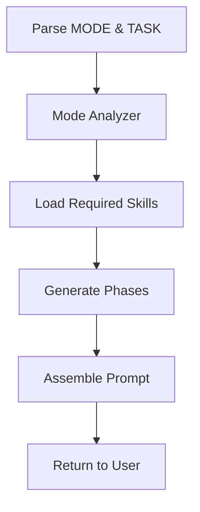

# Skill: 2WHAV Controller

**Orchestrates the 2WHAV framework execution flow.**

---

## Metadata

- **Name:** `2whav_controller`
- **Purpose:** Main entry point for 2WHAV framework
- **Invocation:** When user requests "Apply 2WHAV [MODE] to: [TASK]"

---

## Execution Flow



---

## Input Contract

### Required

- **Command Format:** `Apply 2WHAV [MODE] to: [TASK]`
- **MODE:** MINIMAL | STANDARD | FULL | EVOLVE:N | Custom
- **TASK:** User's requirement description

**Evolution Syntax:**
- `[FULL]` - Uses default 3-5 generations with auto-convergence
- `[EVOLVE:N]` - Explicit control: exactly N generations (e.g., `EVOLVE:3`, `EVOLVE:5`, `EVOLVE:10`)
- Both are equivalent to FULL mode with evolutionary refinement

### Optional

- Domain hints
- Explicit constraints
- Output preferences

---

## Processing Steps

### 1. Parse Command

Extract MODE and TASK from user input.

**Default:** If MODE omitted, use FULL.

### 2. Determine Phases

Read `01-mode-analyzer.md` to get required phases for MODE.

### 3. Generate Each Phase

For each required phase:

- Read corresponding skill file
- Apply skill template to TASK
- Generate phase content

### 4. Assemble Prompt

Combine all phases in order:

```
WHAT → RESEARCH (FULL only) → WHERE (if needed) → HOW → AUGMENT (if needed) → VERIFY
```

### 5. Return Complete Prompt

Deliver structured prompt ready for execution.

---

## Phase Loading Logic

```javascript
// Pseudo-code for phase selection
function getPhasesForMode(mode) {
  const phases = {
    MINIMAL: ['02-what', '05-how', '07-verify'],
    STANDARD: ['02-what', '04-where', '05-how', '07-verify'],
    FULL: [
      '02-what',
      '03-research',
      '04-where',
      '05-how',
      '06-augment',
      '07-verify',
      '08-evolution',  // Iterative refinement meta-process
    ],
  };
  return phases[mode] || phases.FULL;
}
```

---

## Token Optimization

**Load only what's needed:**

- MINIMAL: 3 skills (~3k tokens)
- STANDARD: 4 skills (~4k tokens)
- FULL: 7 skills (~9k tokens including evolution)

**Never load:**

- Skills not required by MODE
- Example sections unless needed
- Redundant documentation

**Note:** FULL mode includes evolution which operates as a meta-process after initial prompt assembly.

---

## Output Format

The controller returns a complete 2WHAV prompt with:

1. **Header:** Framework identification
2. **Phases:** All required phases in order
3. **Index:** Navigation table
4. **Templates:** Populated with TASK specifics

---

## Example

**Input:**

```
Apply 2WHAV [STANDARD] to: Create traffic light FSM
```

**Controller Actions:**

1. Parse: MODE=STANDARD, TASK="traffic light FSM"
2. Load: Mode Analyzer determines phases needed
3. Generate: WHAT, WHERE, HOW, VERIFY
4. Assemble: Combine into structured prompt
5. Return: Complete specification

**Output:** Complete 2WHAV prompt with 4 phases, ready for code generation.

---

**Example (FULL Mode with Evolution):**

**Input:**
```
Apply 2WHAV [FULL] to: Create production-ready rate limiter
```

**Controller Actions:**

1. Parse: MODE=FULL, TASK="rate limiter"
2. Load: All phases including evolution
3. Generate: WHAT, RESEARCH, WHERE, HOW, AUGMENT, VERIFY
4. Assemble: Baseline prompt
5. **EVOLVE:** Run 3-5 generations of iterative refinement
6. Return: Evolved, optimized specification

**Output:** Evolved 2WHAV prompt with enhanced specificity, completeness, and clarity.

---

**Example (Explicit Evolution Control):**

**Input:**
```
Apply 2WHAV [EVOLVE:5] to: Create production-ready rate limiter
```

**Controller Actions:**

1. Parse: MODE=EVOLVE:5, TASK="rate limiter"
2. Treat as FULL mode with exactly 5 generations
3. Generate: WHAT, RESEARCH, WHERE, HOW, AUGMENT, VERIFY
4. Assemble: Baseline prompt
5. **EVOLVE:** Run exactly 5 generations (no early convergence)
6. Return: Evolved, optimized specification

**Output:** Evolved prompt after precisely 5 generations of refinement.

---

## Error Handling

### Invalid MODE

If MODE not recognized → default to FULL

### Missing TASK

If TASK empty → request clarification from user

### Skill Load Failure

If skill file unreadable → skip phase with warning

---

## Related Skills

- **Next:** `01-mode-analyzer.md` (determine phases)
- **Uses:** All phase generator skills (02-06)
