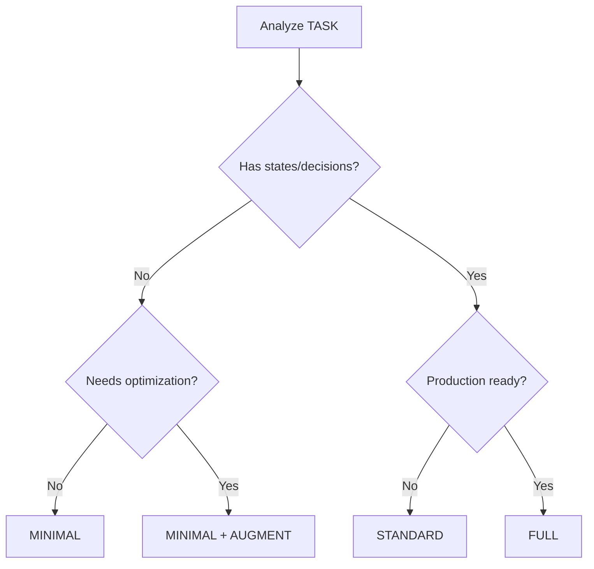

# Skill: Mode Analyzer

**Determines which 2WHAV phases are required based on task characteristics.**

---

## Metadata

- **Name:** `analyze_mode`
- **Purpose:** Phase selection logic for different complexity levels
- **Invoked by:** Controller after parsing user command

---

## Mode Definitions

### MINIMAL (W+H+V)

**Phases:** WHAT + HOW + VERIFY

**Use when:**

- ✅ Pure functional task (input → transform → output)
- ✅ No state management needed
- ✅ Single responsibility function
- ✅ Prototype/proof-of-concept

**Examples:** Parser, validator, formatter, calculator

### STANDARD (W+Wr+H+V)

**Phases:** WHAT + WHERE + HOW + VERIFY

**Use when:**

- ✅ Has states and transitions
- ✅ Conditional logic with priorities
- ✅ Event-driven system
- ✅ Decision trees

**Examples:** FSM, workflow engine, retry logic, traffic controller

### FULL (W+R+Wr+H+A+V+E)

**Phases:** WHAT + RESEARCH + WHERE + HOW + AUGMENT + VERIFY + EVOLUTION

**Use when:**

- ✅ Production-ready system
- ✅ Requires optimization
- ✅ Needs resilience (retry, fallback)
- ✅ Strategic intelligence required
- ✅ Latest best practices are critical
- ✅ User explicitly requests "optimized" or "robust"
- ✅ Prompt quality improvement through iteration is valuable

**Examples:** Game AI, distributed system, rate limiter, decision agent, security system

**Note:** EVOLUTION phase iteratively refines the complete 2WHAV prompt through LLM-based genetic operations, producing an optimized version of the baseline specification.

---

## Decision Tree



---

## Analysis Criteria

### Check for WHERE Phase

Include WHERE if TASK mentions:

- States: "FSM", "state machine", "states"
- Transitions: "when X happens", "if X then Y"
- Priorities: "prioritize", "first check", "hierarchy"
- Control flow: "cycle", "loop", "workflow"

**Keywords trigger:** `state`, `transition`, `priority`, `when`, `if-else`, `cycle`

### Check for AUGMENT Phase

Include AUGMENT if TASK mentions:

- Performance: "fast", "optimized", "efficient", "cache"
- Resilience: "retry", "fallback", "robust", "fault-tolerant"
- Intelligence: "smart", "adaptive", "heuristic", "strategy"
- Production: "production-ready", "enterprise", "scalable"

**Keywords trigger:** `optimize`, `production`, `resilient`, `intelligent`, `robust`

---

## Output

### Format

```json
{
  "mode": "STANDARD",
  "phases": ["what", "where", "how", "verify"],
  "reasoning": "Task involves FSM with state transitions"
}
```

### Phase Map

```javascript
{
  "what": "02-what-generator.md",      // Always
  "research": "03-research-generator.md", // FULL only
  "where": "04-where-generator.md",    // Conditional
  "how": "05-how-generator.md",        // Always
  "augment": "06-augment-generator.md",// Conditional
  "verify": "07-verify-generator.md",  // Always
  "evolution": "08-evolution-generator.md" // FULL only (meta-process)
}
```

---

## Examples

### Example 1: MINIMAL

**Task:** "Create a CSV parser"

**Analysis:**

- No states → WHERE not needed
- Simple transform → AUGMENT not needed
- Result: MINIMAL (W+H+V)

### Example 2: STANDARD

**Task:** "Create traffic light FSM"

**Analysis:**

- Has states (red, yellow, green) → WHERE needed
- Transitions clear → FSM architecture
- No optimization requested → AUGMENT not needed
- Result: STANDARD (W+Wr+H+V)

### Example 3: FULL

**Task:** "Create production-ready rate limiter with circuit breaker"

**Analysis:**

- Has states (open, half-open, closed) → WHERE needed
- "Production-ready" → AUGMENT needed
- Complex logic → All phases required
- "Production-ready" → EVOLUTION for optimization
- Result: FULL (W+R+Wr+H+A+V+E)

**Evolution Impact:** The baseline prompt undergoes 3-5 iterations of refinement, with mutations adding specific edge cases, sharpening constraints to measurable thresholds, and expanding API documentation. Final prompt is validated to be superior to baseline on multiple criteria.

---

## Custom Modes

If user specifies custom phase combination:

```
Apply 2WHAV [WHAT + HOW + AUGMENT + VERIFY] to: optimized parser
```

Use explicit phases:

- what: true
- where: false (user skipped)
- how: true
- augment: true
- verify: true

---

## Related Skills

- **Called by:** `00-controller.md`
- **Returns to:** Controller with phase list
- **Enables:** Phase generators (02-06)
