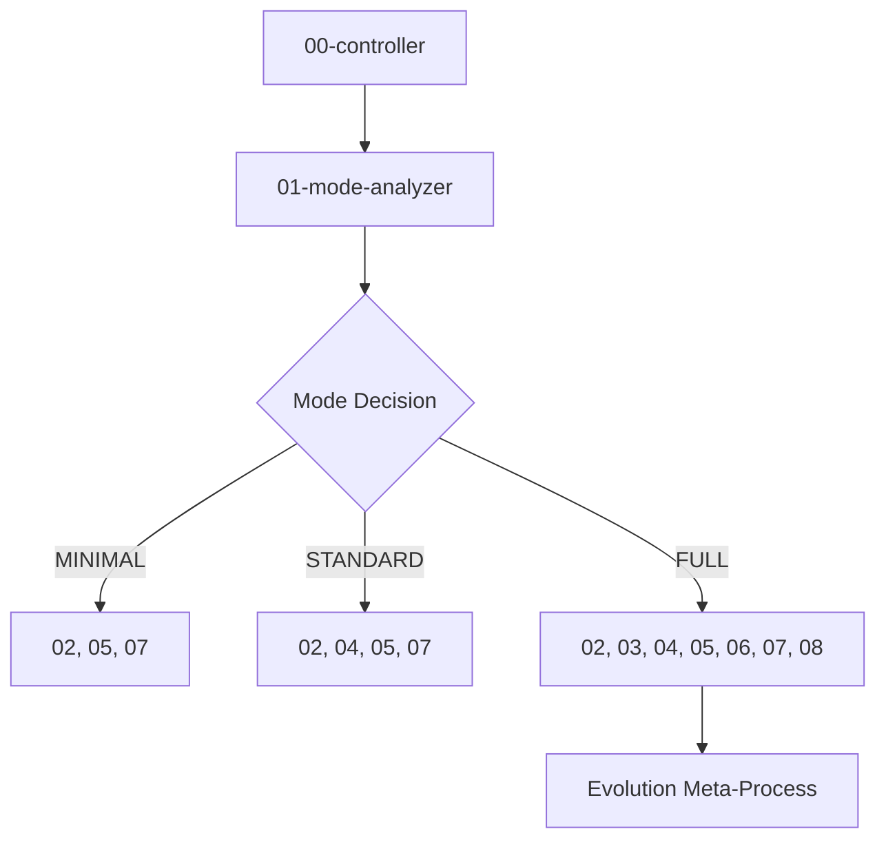

# 2WHAV Skills Directory

**Modular phase generators for structured prompt engineering.**

---

## Skills Overview

| Skill                   | File                        | Required    | Purpose                | Lines | Tokens |
| ----------------------- | --------------------------- | ----------- | ---------------------- | ----- | ------ |
| **Controller**          | `00-controller.md`          | Always      | Orchestrates workflow  | ~170  | ~1250  |
| **Mode Analyzer**       | `01-mode-analyzer.md`       | Always      | Determines phases      | ~195  | ~1450  |
| **WHAT Generator**      | `02-what-generator.md`      | Always      | Defines persona + task | ~330  | ~2500  |
| **RESEARCH Generator**  | `03-research-generator.md`  | FULL only   | Knowledge expansion    | ~295  | ~2200  |
| **WHERE Generator**     | `04-where-generator.md`     | Conditional | Defines architecture   | ~245  | ~1850  |
| **HOW Generator**       | `05-how-generator.md`       | Always      | Defines syntax/API     | ~265  | ~2000  |
| **AUGMENT Generator**   | `06-augment-generator.md`   | FULL only   | Adds intelligence      | ~260  | ~1950  |
| **VERIFY Generator**    | `07-verify-generator.md`    | Always      | Creates validation     | ~300  | ~2250  |
| **EVOLUTION Generator** | `08-evolution-generator.md` | FULL only   | Iterative refinement   | ~330  | ~2500  |

**Total Framework:** ~2,390 lines / ~17.95k tokens

---

## How LLMs Use These Skills

### Step 1: Entry Point

When user says: `"Apply 2WHAV [MODE] to: [TASK]"`

### Step 2: Load Controller

Read `00-controller.md` to understand orchestration.

### Step 3: Determine Phases

Read `01-mode-analyzer.md` to get required phases for MODE.

### Step 4: Generate Phases

For each required phase, read its skill file and apply template.

### Step 5: Assemble

Combine all generated phases into complete 2WHAV prompt.

---

## Token Budget by Mode

| Mode         | Skills Loaded | Approx Tokens | Context Used (32k) | Context Used (64k) |
| ------------ | ------------- | ------------- | ------------------ | ------------------ |
| **MINIMAL**  | 4 skills      | ~5,000        | ~16%               | ~8%                |
| **STANDARD** | 5 skills      | ~7,000        | ~22%               | ~11%               |
| **FULL**     | 9 skills      | ~15,500       | ~48%               | ~24%               |

**Result:** Even on 32k context models, FULL mode leaves 16.5k+ tokens for work.

**Note:** FULL mode includes EVOLUTION which operates as a meta-process, refining the complete prompt through 3-5 generations of LLM-based genetic operations.

---

## Skill Loading Order



---

## Skill Structure

Each skill follows this pattern:

```markdown
# Skill: [Name]

## Metadata

- Name, purpose, when to use

## Input Contract

- Required and optional inputs

## Output Template

- Exact format to generate

## Logic/Examples

- How to populate template

## Related Skills

- Previous/next in workflow
```

---

## Adding Custom Skills

To add domain-specific variations:

1. Create new file: `0X-custom-name.md`
2. Follow existing skill structure
3. Keep under 130 lines (~1k tokens)
4. Include ONE clear example
5. Link to related skills

---

## Best Practices

### For Efficiency

- Only load skills needed for current mode
- Skip example sections if not needed
- Cache skill contents if generating multiple prompts

### For Quality

- Follow templates exactly as specified
- Use prescriptive language (MANDATORY/FORBIDDEN)
- Be specific, never vague
- Include concrete examples

---

_Skills are designed for maximum token efficiency while maintaining framework rigor._
